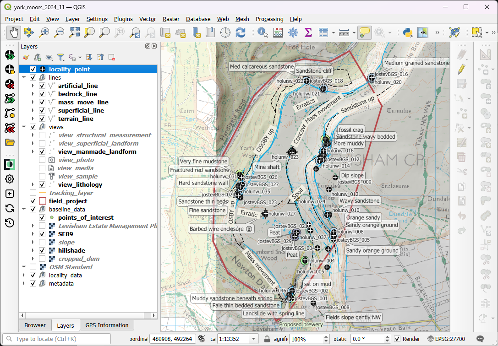

<!--
Copyright 2026 UKRI / British Geological Survey
Licensed under GPLv3 licence
SPDX-License-Identifier: GPL-3.0-or-later
-->

# CRAG QGIS plugin

> CRAG (Collection and Reporting of Associated Geodata) is a QGIS plugin developed by the British Geological Survey (BGS) for digital field data capture and geological mapping.

⚠ Note to users: The CRAG plugin will be released for external testing to the _experimental_ QGIS plugin repository.
The aim is to gain feedback, particularly around documentation, prior to a full release.
Please report any issues on the [Issue Tracker](https://github.com/BritishGeologicalSurvey/CRAG/issues). ⚠

The CRAG plugin performs three main functions:

  1) Adds layers to a QGIS project for geological mapping work, complete with configured styles, forms and GeoPackage database
  2) Provides tools for efficient data entry/editing and for photo imports
  3) Generates reports in HTML and PDF formats

The underlying data model, feature lists, feature and line types and styling follow BGS standards developed over many years.
CRAG projects use advanced features of QGIS forms, such as Relation References and Expressions, and of GeoPackage databases, such as foreign-key references and views, to create a more expressive data model than the flat table structures normally associated with GIS data.
This ensures that collected field data are compatible with BGS systems and data.

See the User Guide for details: https://britishgeologicalsurvey.github.io/CRAG

## Installation

CRAG is awaiting approval from the QGIS Plugin Repository, which will be the preferred installation method when available.

You can also download and install the CRAG plugin as a ZIP file from the [Latest Release Assets](https://github.com/BritishGeologicalSurvey/CRAG/releases/latest).

In QGIS, select _Plugins > Manage and Install Plugins > Install from ZIP_

The release assets also include an empty CRAG data GeoPackage and Entity Relationship (ER) diagrams that describe the CRAG data model.

## Collaborative working

Mergin Maps is an open-source system for synchronisation of QGIS project data between multiple users and for data collection on mobile devices such as phones and tablets.
CRAG has been designed so that the resulting project is self-contained and can be used without requiring the CRAG plugin.
This makes CRAG projects compatible with the Mergin Maps software ecosystem.

## Useful links

+ [British Geological Survey](https://www.bgs.ac.uk)
+ [QGIS Documentation](https://docs.qgis.org/3.44/en/docs/)
+ [MerginMaps documentation](https://merginmaps.com/docs/)

## Licence

CRAG is distributed under the GPLv3 licence. Copyright: © British Geological Survey 2026
