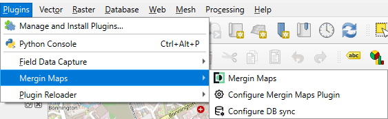

# Installing CRAG

## Install QGIS

QGIS, and the required plugin, can be installed on Windows, Linux or Mac computers, installation is [described on the QGIS website](https://qgis.org/resources/installation-guide/). It is recommended that the current Long Term Release (LTR) version is installed. While the CRAG plugin should function correctly using the Latest Release (LR), this version of QGIS may be subject to change and so the plugin may not offer the best user experience.

## Install CRAG Plugin

The CRAG plugin can be installed from a zip file via the `Plugins` menu.

Select `Manage and Install Plugins`.

:::{figure-md}
{align=center}

*Plugins Menu*
:::

Select `Install from ZIP` and choose the ZIP file using the file chooser.

:::{figure-md}
{align=center}

*Install from ZIP*
:::

Click `Install Plugin` and then confirm

:::{figure-md}
{align=center}

*Confirm Install from ZIP*
:::

Once installed, the plugin can be accessed from the `Plugins` menu and the `CRAG Toolbar`:

:::{figure-md}
{align=center}

*CRAG Menu*
:::

:::{figure-md}
{align=center}

*CRAG Toolbar*
:::

:::{note}
If the CRAG plugin toolbar is missing, try disabling and re-enabling it from the Plugin Manager.
:::

### Moving the Plugin Toolbar

By default the plugin toolbar will appear on the last row of the QGIS toolbars.

:::{figure-md}
{align=center}

*Default Plugin Toolbar*
:::

The toolbar can be moved within the main toolbars, or repositioned on any edge of the QGIS window, by dragging the toolbar from its left edge.

:::{subfigure} AB
:subcaptions: below
:gap: 0

:::

Other QGIS toolbars can also be moved in the same way.

## Mergin Maps

### Install Mergin Maps Plugin

To install the Mergin Maps plugin, follow the official instructions [here](https://merginmaps.com/docs/setup/install-mergin-maps-plugin-for-qgis/).

Once installed, the plugin can be accessed from the `Plugins` menu and the `Mergin Maps Toolbar`:

:::{figure-md}
{align=center}

*Mergin Maps Menu*
:::

:::{figure-md}
{align=center}

*Mergin Maps Toolbar*
:::

To use the plugin requires a user account on the Mergin Maps website or on an independently hosted Mergin Maps server. Please see the [Mergin Maps website](https://merginmaps.com/) for more information.

:::{note}
When logging into the plugin with your Mergin Maps account, you can save your login details if you have set a Master Password for QGIS. You can find official information about the QGIS Master Password [here](https://docs.qgis.org/latest/en/docs/user_manual/auth_system/auth_overview.html?highlight=password#master-password).
:::
