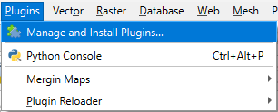
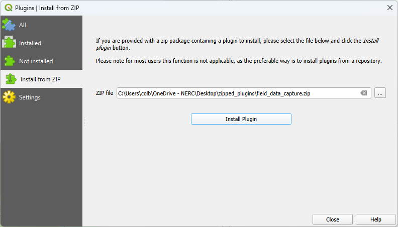
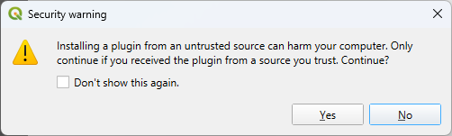
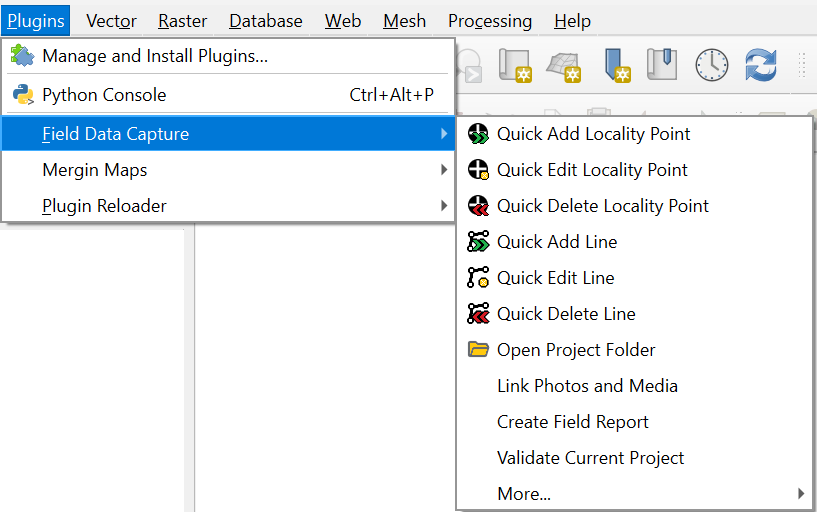
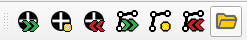
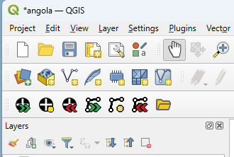
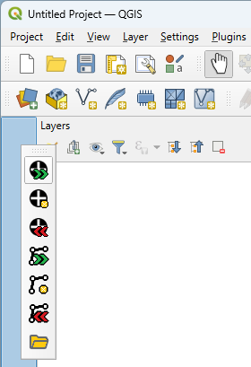
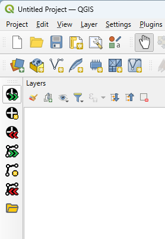

# Installing CRAG

CRAG comprises a plugin for QGIS:

 - The CRAG plugin is written by BGS and is used to collect data.
   It adds the required GeoPackage database and layers to a project so that data can be collected in BGS format.
   It also provides tools to manage photos, create a field report and validate data.

## Install QGIS

QGIS, and the required plugin, can be installed on Windows, Linux or Mac computers, installation is [described on the QGIS website](https://qgis.org/resources/installation-guide/).

## Install Field Data Capture Plugin

The Field Data Capture plugin can be installed from a zip file via the `Plugins` menu.

Select `Manage and Install Plugins`.

:::{figure-md}
{align=center}

*Plugins Menu*
:::

Select `Install from ZIP` and choose the ZIP file using the file chooser.

:::{figure-md}
{align=center}

*Install from ZIP*
:::

Click `Install Plugin` and then confirm

:::{figure-md}
{align=center}

*Confirm Install from ZIP*
:::

Once installed, the plugin can be accessed from the `Plugins` menu and the `Field Data Capture Toolbar`:

:::{figure-md}
{align=center}

*Field Data Capture Menu*
:::

:::{figure-md}
{align=center}

*Field Data Capture Toolbar*
:::

:::{note}
If the Field Data Capture plugin toolbar is missing, try disabling and re-enabling it from the Plugin Manager.
:::

### Moving the Plugin Toolbar

By default the plugin toolbar will appear on the last row of the QGIS toolbars.

:::{figure-md}
{align=center}

*Default Plugin Toolbar*
:::

The toolbar can be moved within the main toolbars, or repositioned on any edge of the QGIS window, by dragging the toolbar from its left edge.

:::{subfigure} AB
:subcaptions: below
:gap: 0

:::

Other QGIS toolbars can also be moved in the same way.
