# Working with Lines

## Buttons and Menu for Lines

The toolbar has three buttons for working with Line data.

:::{figure-md}
{align=center}

*CRAG Toolbar*
:::

{class=icon} Quick Add Line

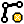{class=icon} Quick Edit Line

{class=icon} Quick Delete Line

The same buttons are available from the plugin menu.

:::{figure-md}
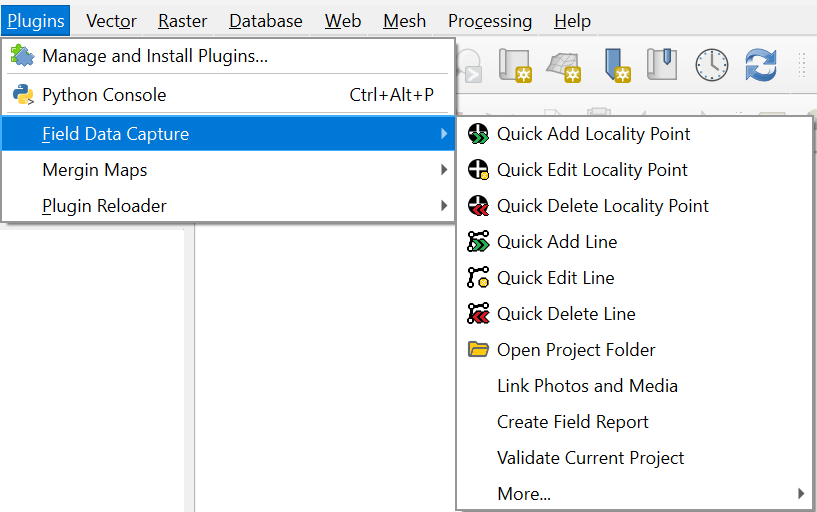{align=center}

*CRAG Menu*
:::

::::{note}

Before adding, editing or deleting lines, please ensure that the lines layer is visible by checking the box for all `lines`, or the subset of lines you are working with, in the `Layers` panel.

:::{figure-md}
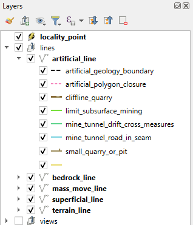{align=center}

*Show lines layers*
:::

::::

(adding-lines)=
## Adding Lines

### Selecting the line type

To add a new line click the `Quick Add Line` button {class=icon} from the plugin toolbar or menu. The button should show as selected and the `Select Line Type` dialog box will appear, from which there are a number of ways to select the line type.

:::{figure-md}
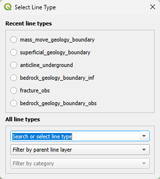{align=center}

*Select line type*
:::

#### Select from Recent line types

The quickest method is to click on one of the `Recent line types`.

:::{note}

This list is contains the most-recently used line types, in descending order.
The most recently selected line type is added to the top of the list, with the others moving down.

:::

#### Search or select from All line types

The `Search or select line type` box initially gives access to all line types.
Start typing to search, or use the drop-down to browse available types.
Click the line name to select it.

:::{subfigure} AB
:subcaptions: below
:gap: 0

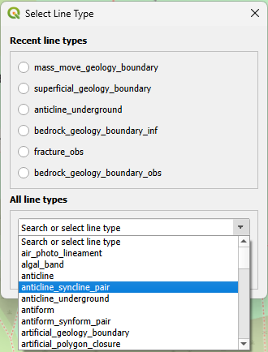
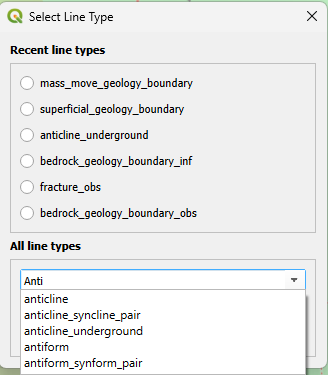

:::

#### Filter line types before searching or selecting

To filter line types by the parent line layer, select the layer from the second drop-down menu, `Filter by parent layer`.
The available line types can optionally be filtered further by selecting the category from the third drop-down menu, `Filter by category`.

:::{subfigure} AB
:subcaptions: below
:gap: 0

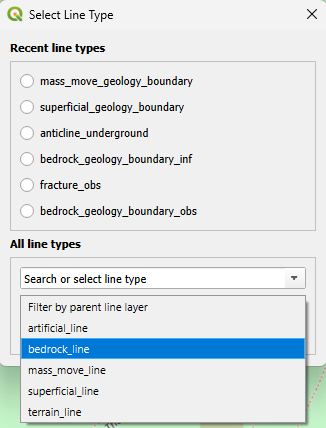
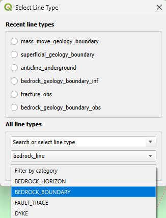

:::

Use the `Search or select line type` box, which now contains a filtered list of line types, to choose.

:::{subfigure} AB
:subcaptions: below
:gap: 0

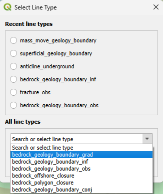
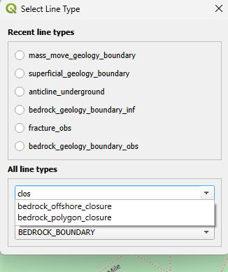

:::

### Drawing a line

Once a line type is selected, the cursor will change to a cross-hairs when over the map.
You can now digitise the line by left clicking, with a right-click to end the line.

QGIS has different digitising modes.
To set the mode, click the down arrow on the `Toggle stream digitizing mode` button on the QGIS toolbar.
This selection will be remembered, though it can be changed at this point before drawing a new line.

The two recommended options are `Digitize with Segment` and `Stream Digitizing`.
The first allows a line to be drawn using straight line segments. 
The second allows for freehand drawing of a line with a pen, mouse or trackpad.

:::{figure-md}
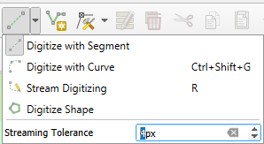{align=center}

*Set Digitizing Mode*
:::

Now draw the line on your laptop or tablet.

By default, once the line is complete, a line Feature Attributes dialog will appear.
Here the category and type can be changed if necessary.
The suggested attributes vary with line type and should be added to the notes.

If required, the attributes form step can be skipped by unchecking the `Show attribute form for new lines` box in the [Plugin Settings](#plugin-settings).
This is useful for rapidly digitising multiple lines with no additional attributes.
If attributes are needed these can be added later by editing the line.

:::{figure-md}
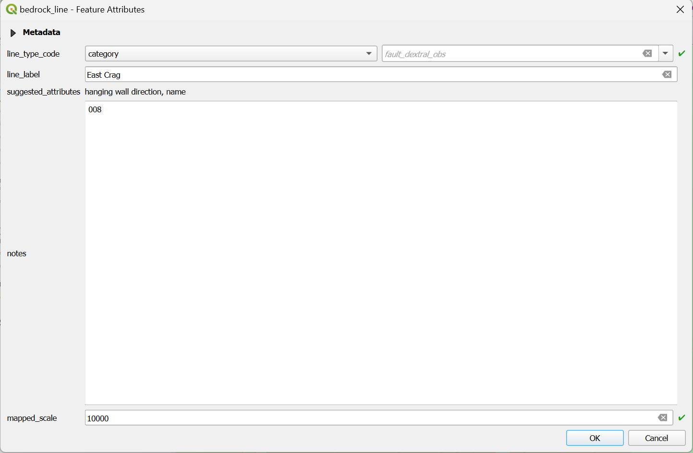{align=center}

*Line details*
:::

Clicking OK will save the line. It will now be shown on the map using appropriate symbology.
The contents of the _line\_label_ field are used to label the line.

:::{figure-md}
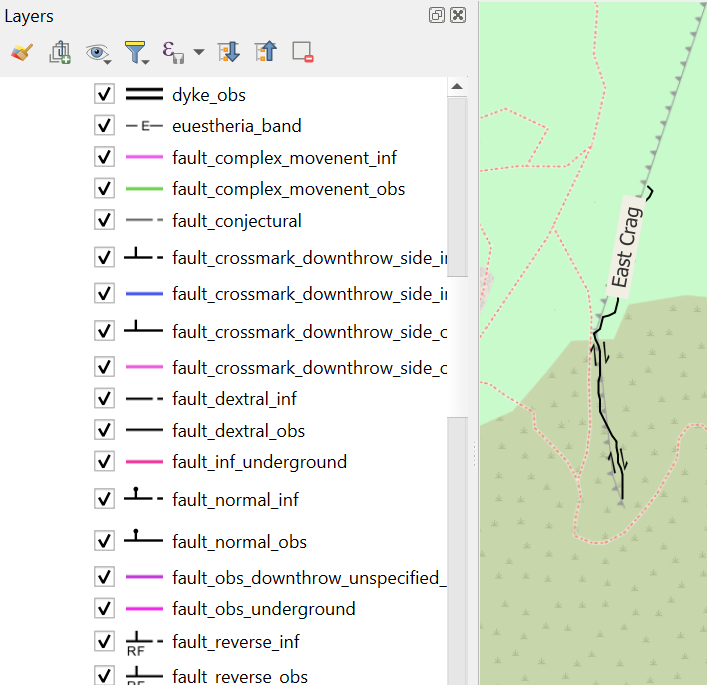{align=center}

*Displayed Line*
:::

## Editing Lines

To edit line attributes, click the `Quick Edit Line` button {class=icon} from the plugin toolbar or menu.
The button should show as selected and the cursor will change to an arrow pointer with a small `i` when over the map.
Select the line you wish to edit using the cursor, a line features attribute dialog will appear.
Here the category, type and suggested attributes can be changed and then saved by clicking OK.

:::{figure-md}
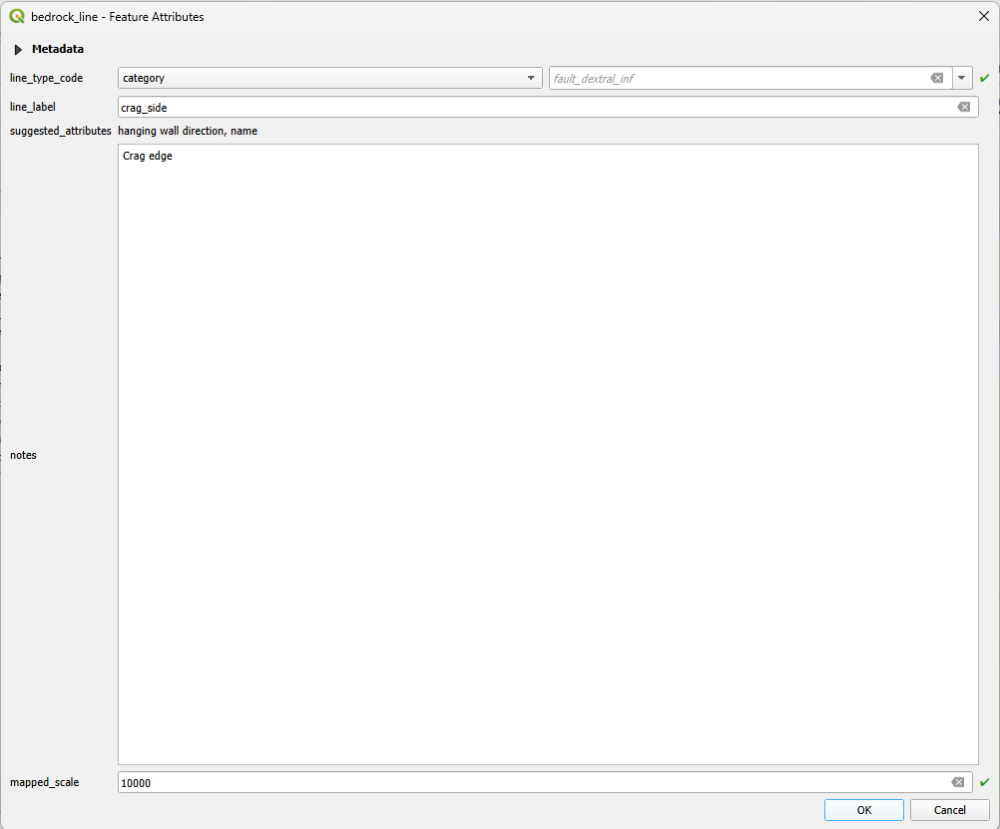{align=center}

*Line Edit*
:::

The metadata section of the dialog can be expanded to show the line length and azimuth.
:::{figure-md}
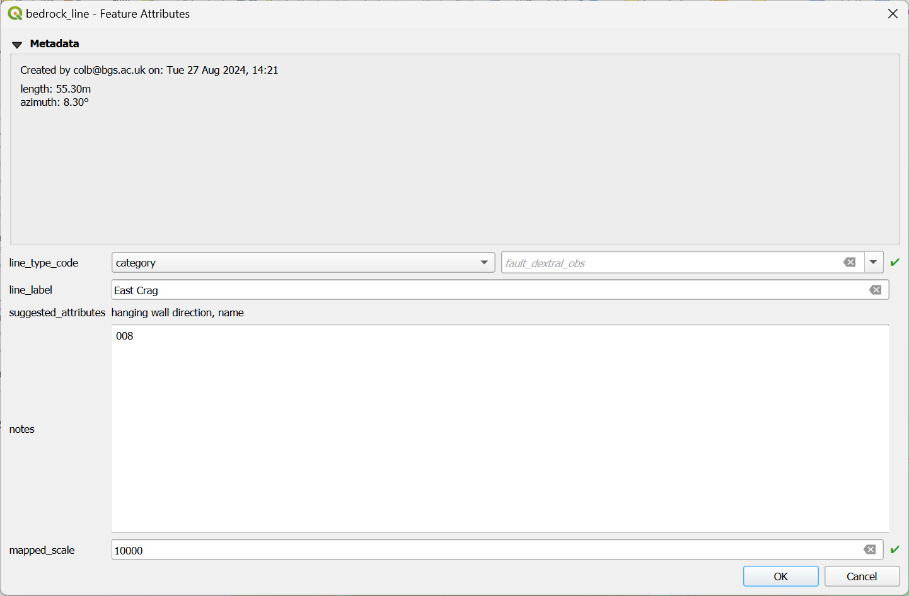{align=center}

*Line Metadata*
:::

The edit the line geometry:

+ Click the `Quick Edit Line` button to ensure that all line layers are active and editable
+ Select the `Vertex tool` from the Digitising Toolbar
+ Click and/or drag the line vertices as required
+ Press the "Save" button to save changes.

The `Advanced Digitising Toolbar` includes a `Reverse line` tool.
Select it, then click a line to change its direction.

## Deleting Lines

To delete a line click the `Quick Delete Line` button {class=icon} from the plugin toolbar or menu. The button should show as selected and the cursor will change to a cross when over the map. Click the cross on the  line. A warning dialog will appear, click Yes to delete the point or No to cancel.

:::{figure-md}
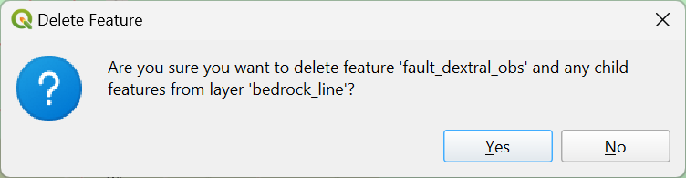{align=center width=400px}

*Delete a Line*
:::

:::{note}
Creating and editing of lines is still in development.
Future releases will have a use a refined data model where different line types will have specific attribute fields, instead of just "notes".
:::
