# Working with Locality Points

## Buttons and Menu for Points 

The toolbar has three buttons for working with locality point data.

:::{figure-md}
{align=center}

*CRAG Toolbar*
:::

{class=icon} Quick Add Locality Point

{class=icon} Quick Edit Locality Point

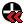{class=icon} Quick Delete Locality Point

The same buttons are available from the plugin menu.

:::{figure-md}
{align=center}

*CRAG Menu*
:::

::::{note}

Before adding, editing or deleting locality points, please ensure that the locality point layer is visible by checking the box `locality_point` in the `Layers` panel.

:::{figure-md}
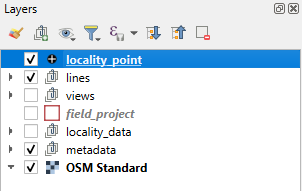{align=center}

*Show locality point layer*
:::

::::

(adding-points)=
## Adding Locality Points

To add a new locality point click the `Quick Add Locality Point` button {class=icon} from the plugin toolbar or menu.
The button should show as selected and the cursor will change to a cross-hairs when over the map.
Click the cross-hairs on the position of the new locality point, a Feature Attributes form should appear with a single Locality tab.

:::{figure-md}
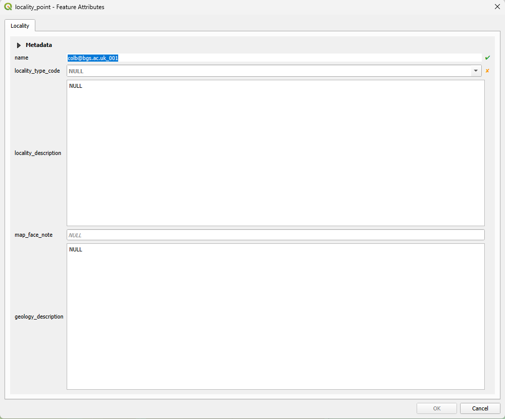{align=center}

*Feature Attributes - New Locality Point*
:::

The fields here are

`name` _required_
: This name is automatically generated from your username and is not editable

`locality_type_code` _required_
: Choose the type of the locality from the drop-down list.
  The plugin will default to the most recently selected value.

`locality_description`
: A description of the locality itself, e.g. _"4 m tall road cut south of the bridge"_.

`map_face_note`
: Short, one-line, note that will appear as an annotation on the locality point.

`geology_description`
: A description of the geology at the locality, e.g. _"Cream coloured fine to medium sandstone with muddy partings. Moderately sorted. Beds slightly wavy, 5-25 cm thick."_
  When the [Extended map face notes](#plugin-settings) setting is enabled, the annotation on the locality point will comprise both the map face note and this geology description.
  This is useful where you want to display multi-line notes on the map, e.g. augur log data (_"0-0.4 silty sandy soil\n1.5 silty sand\n1.7+ grey gravelly clay"_)

:::{figure-md}
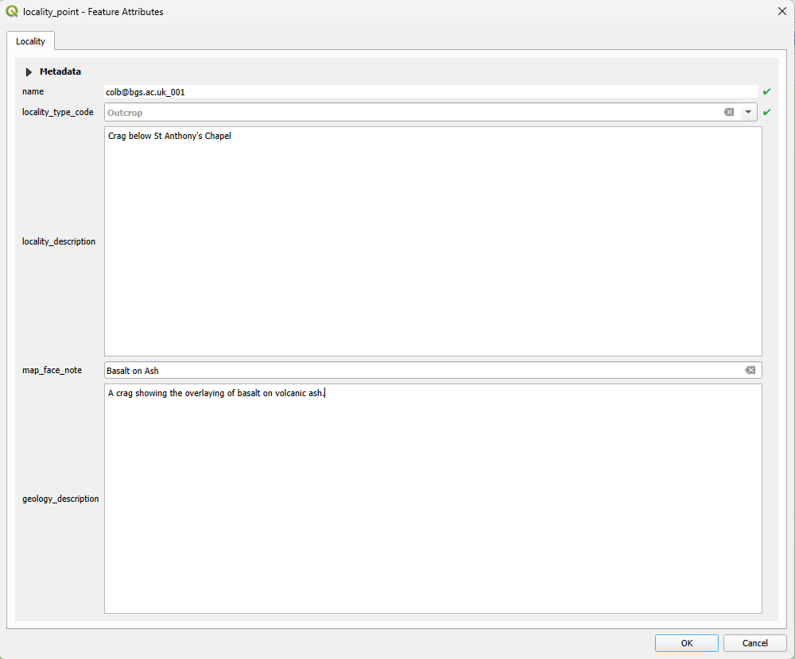{align=center}

*Completing details*
:::

Once you have completed the fields click `OK`.

The form will change to display tabs for the child features of the locality point.
The child features that can be added are: Lithology, Structural Measurements, Manmade Landforms, Superficial Landforms, Photos, Samples and Media.

:::{figure-md}
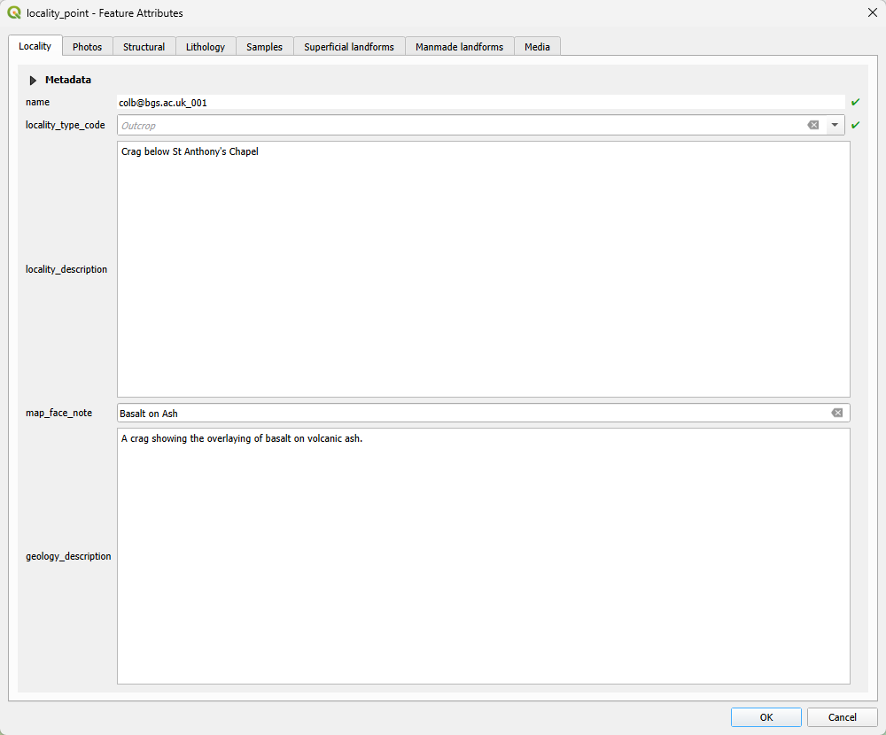{align=center}

*Details completed, child tabs visible*
:::

On the main Locality tab there is a Metadata section which can be expanded or collapsed by clicking on the black triangle. This shows further information about the locality point including the co-ordinates in the local co-ordinate reference system, who collected the point and when.

:::{figure-md}
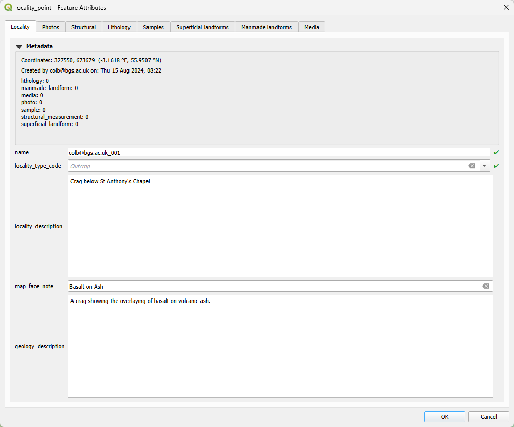{align=center}

*Metadata*
:::

### Adding Child Features

#### Lithology

To add a child feature, such as Lithology, click on the tab.
In the top left of each tab there is a toolbar for adding and editing child feature.
These are the standard QGIS tools for editing vector layer data.
The button with the yellow pencil is used to Toggle Editing Mode.

:::{figure-md}
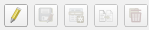{align=center}

*Child Feature Toolbar - default*
:::

To add or edit a child feature, click on the Toggle Editing Mode button. This will enable the next two buttons, Save Child Layer Edits and Add Child Feature, respectively.

:::{figure-md}
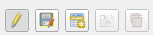{align=center}

*Child Feature Toolbar - editing enabled*
:::

Click on Add Child Feature and a new form will appear to enter the lithology details. Select the *required* lithology code from the drop-down list or start typing to narrow the search. For example, typing `Bas` should show Basalt as option.

:::{figure-md}
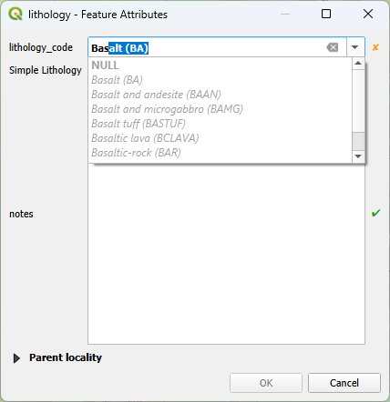{align=center}

*Lithology details*
:::

:::{note}
The new child feature form may appear at a different size and position to the main form.
It can be resized and repositioned if necessary, its new size and position will be remembered
by QGIS.
:::

:::{important}
The new child feature form is not modal, this means that it is possible to make changes in the
main QGIS window while this form is open. To avoid any problems you should avoid making any such
changes before clicking OK or Cancel, returning to the main form and saving any changes.
:::

Click `OK` and the lithology should appear in the left side list, in green italics. This indicates that it has been created but not yet saved.

:::{figure-md}
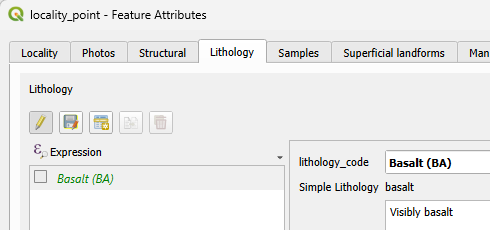{align=center}

*Unsaved Lithology*
:::

Click on the Save Child Layer Edits button and the list entry should display in a plain black font.

:::{figure-md}
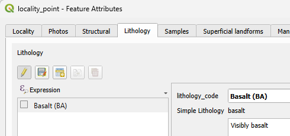{align=center}

*Saved Lithology*
:::

If you need to edit the child feature details at this point, simply click on the lithology name on the left. 

:::{figure-md}
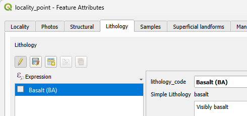{align=center}

*Editing the Lithology*
:::

The details can then be edited in the panel on the right. Once a child feature has been modified its name on the left will be shown in red italics, indicating that it has been modified but not yet saved. Again, click the Save Child Layer Edits button after editing the details.

After adding or editing the child features in a tab, click on the Toggle Editing Mode button to disable editing.

:::{note}
If there are unsaved changes when you toggle the editing mode, you will see a warning dialog. This dialog allows you to save the changes, discard them or return to editing mode by clicking cancel.

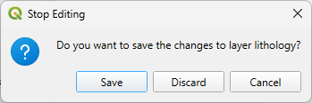{align=center width=400px}
:::

#### Structural Measurement

Click on the Structural tab and then Toggle Editing Mode button, to add a new child feature.

:::{figure-md}
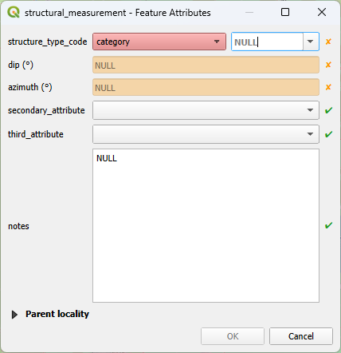{align=center width=400px}

*Structural Measurement*
:::

A structural measurement requires a structure type code to be selected from the drop-down list.

:::{figure-md}
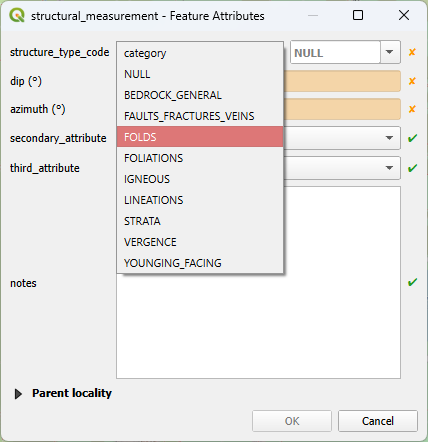{align=center width=400px}

*Structure Type Code*
:::

And then a sub-category.

:::{figure-md}
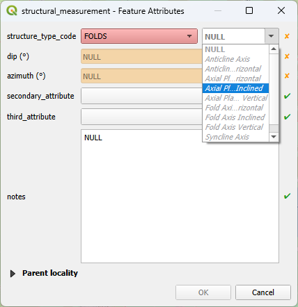{align=center width=400px}

*Structure sub-category*
:::

Dip and azimuth, both in degrees, are also required. Depending on the structure type, an optional secondary attribute may be selectable from the drop-down list.

:::{figure-md}
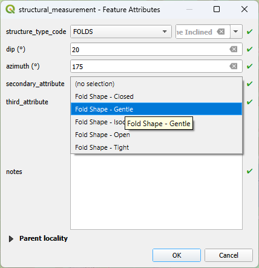{align=center width=400px}

*Secondary Attribute*
:::

Depending on the secondary attribute, an optional third attribute may be selectable from the drop-down list.

:::{figure-md}
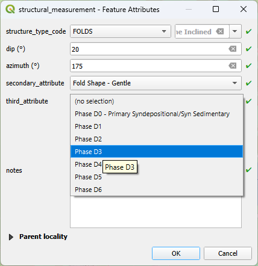{align=center width=400px}

*Third Attribute*
:::

Once the form is complete click on `OK` and then the Save Child Layer Edits button.

#### Sample

Sample details can be added via the Samples tab, a sample ID and type code are both required.
The most recently saved sample ID is displayed to help in setting the new sample ID.
There are no constraints on the format of the sample ID - this should be agreed with the project lead.

:::{figure-md}
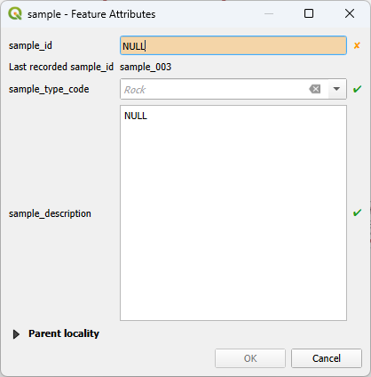{align=center width=400px}

*Sample*
:::

#### Manmade and Superficial Landforms

These two features have similar forms. In each case a type code must be selected from the drop-down list. Once a type is selected the form may change to include additional *required* attributes such as azimuth and dip, both in degrees. Other *optional* size attributes: length, width, and height or depth are in metres.

:::{figure-md}
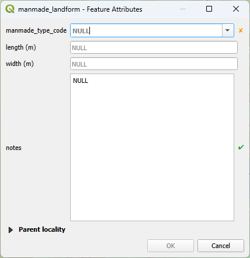{align=center width=400px}

*General Manmade Landform*
:::

:::{figure-md}
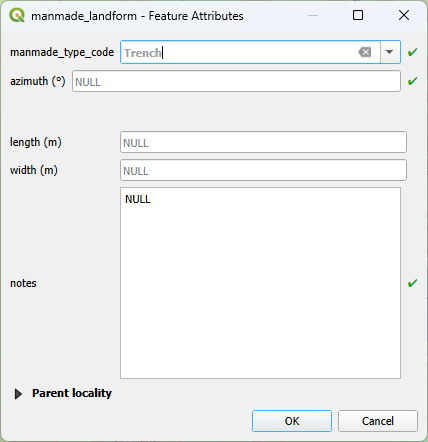{align=center width=400px}

*Specific Manmade Landform*
:::

(add-photos-and-media-when-creating-a-point)=
#### Photos and Media

Photographs and media, of various file types, can be added to the locality point. For the files to be shareable through Mergin Maps they should first be placed in the `photos` or `media` folders, respectively, within the project folder.

By default a new photo or media file will show a placeholder image. This allows the caption and descriptions to be entered in the field
with the photograph or file, perhaps on a different device, to be added into the folder later and then linked using the Photo Linker tool. However, the placeholder image can be replaced immediately if the required file is already in the photos or media folders.

The form validation will not allow you to add a photo from outside the appropriate folder.

For a photo, click on the button containing the three dots to select the photo using the file browser or enter the name directly.

:::{figure-md}
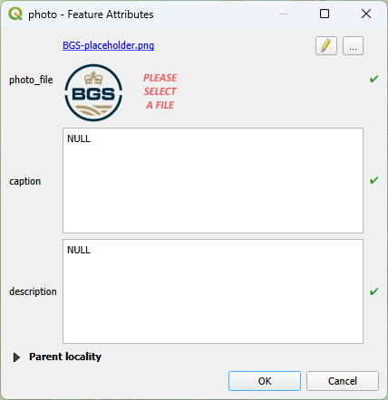{align=center width=400px}

*Adding a Photo*
:::

The path to the photo can be edited directly using the pencil button or found by using the file selector button with the three dots.
:::{figure-md}
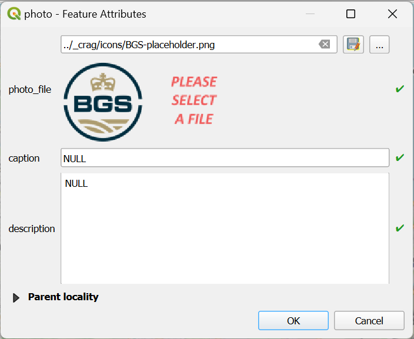{align=center width=400px}

*Editing the Photo Filepath*
:::

The photo will display in the form where a caption and description can be added.

:::{figure-md}
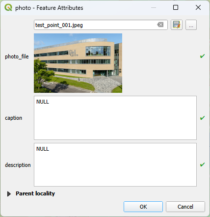{align=center width=400px}

*Added Photo*
:::

:::{note}
Due to the internal specification of BGS systems, the caption is limited to 250 characters.

:::

Click on `OK` and then the Save Child Layer Edits button and the photo will show in the right panel of the main form. The filename is also a link to open the photo in the system application for viewing images.

:::{figure-md}
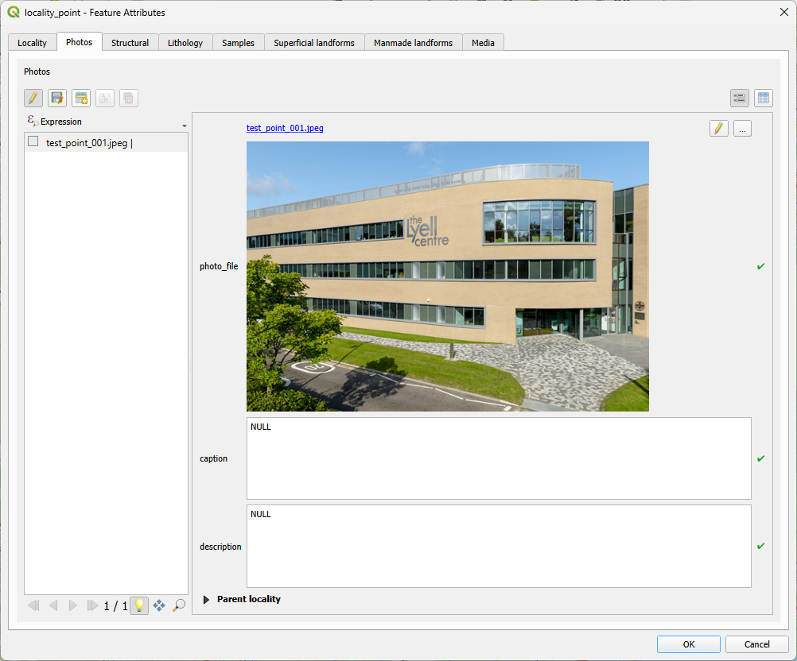{align=center}

*Photo Added*
:::

Other media, images, text files, data files, sound notes or videos, can be added in a similar way, under the Media tab.
:::{figure-md}
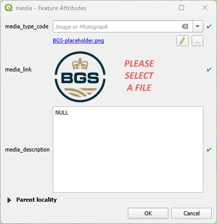{align=center width=400px}

*Add Media*
:::

Before choosing a file, the *required* media type code needs to be selected according to the media file type.

:::{figure-md}
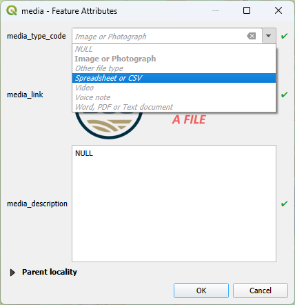{align=center width=400px}

*Select Media Type*
:::

Once all locality point children have been added and saved, click `OK` in the main dialog and save the project. The locality point should now be visible on the map. By default several symbols representing the locality point and its child features will be displayed over each other depending on the layer ordering. The point's id and map face note, if any, should be visible.

:::{figure-md}
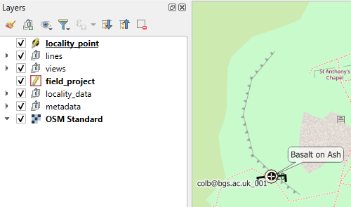{align=center}

*Locality Point*
:::

::::{important}
If you click OK to close the main form, without having saved all child features, you will be notified of any unsaved changes.

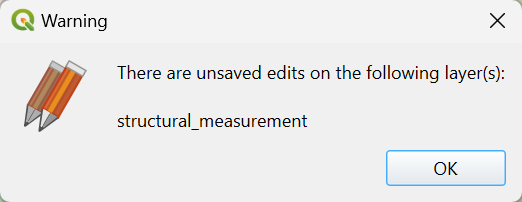{align=center width=400px}

You can save all changes from the `Current Edits` button on the main QGIS toolbar by selecting `Save for All Layers`.

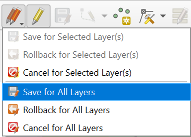{align=center width=400px}

:::{caution}
This method saves *all* of the unsaved changes of *all* features of *all* layers.
Right click on a layer in the layer menu to save only its changes.
:::

:::{note}
Selecting `Rollback for All Layers` will discard all unsaved changes.
:::

::::

## Display of locality point data

Layers, in the layer tab on the left, can be turned on and off to display the pertinent symbols and measurements.
"Views" are used to display locality point child features, if they exist, at the appropriate map location.

De-select `locality_point` and `view_lithology` and select `view_structural_measurement` to show the structural measurement symbol and dip.

:::{figure-md}
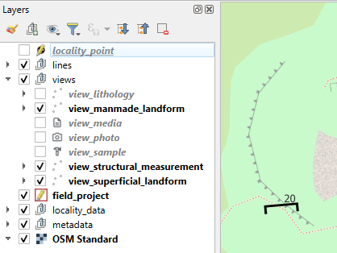{align=center}

*Show Structural Measurements*
:::

De-select `locality_point` and `view_structural_measurement` and select `view_lithology` to show the lithology symbol.

:::{figure-md}
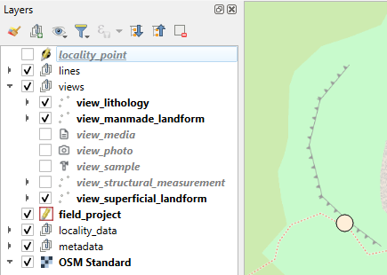{align=center}

*Show Lithology*
:::

De-select `locality_point`, `view_lithology` and `view_structural_measurement` and select `view_photo` to show those points which have photos.

:::{figure-md}
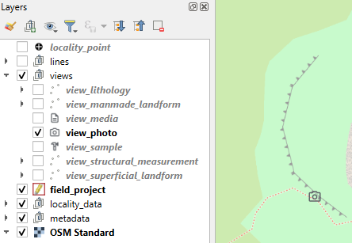{align=center}

*Show if Photo is Attached*
:::

:::{note}
If there are no child features of a particular type then no symbols will be shown if the layer is selected.
For example, there is no manmade landform for the locality point above.
:::

## Map Tips

Map tips can be used to display summary data selected QGIS layers when you hover the mouse over them.
To enable map tips, select the button `Show Map Tips` on the QGIS main menu bar.
(Note that where there are multiple child items (e.g. samples) at a given locality point only data for the first one is shown).

Summary data is show for locality point child view layers.
A thumbnail image is displayed for photos.

:::{figure-md}
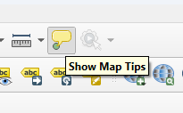{align=center}

*Select Show Map Tips*
:::

To view the map tips for a locality point child layer check and highlight the view layer.
Then hovering over a locality point with the cursor will show the map tip for that feature.

For example, to view the map tip for a Structural Measurement, check and highlight `view_structural_measurement`.

:::{figure-md}
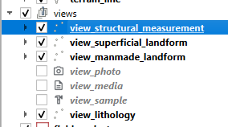{align=center}

*Check and Highlight view_structural_measurement*
:::

Then hover over the locality point to see the map tip, which in this case displays relevant data for the first feature of that type.

:::{figure-md}
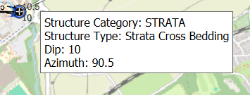{align=center}

*Structural Measurement Map Tip*
:::

To view the map tip for a photo, check and highlight `view_photo`.

:::{figure-md}
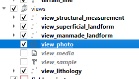{align=center}

*Check and Highlight view_photo*
:::

Then hover over the locality point to see the map tip, which in this case shows the file name, thumbnail photo and caption (which may be truncated to fit in the map tip) for the first photo of that locality point.
Clicking on the thumbnail will open the full image in the computer's image viewer software.

:::{figure-md}
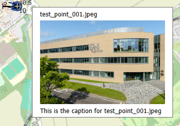{align=center}

*Photo Map Tip*
:::

## Editing Locality Points

To edit a locality point, click on the `Quick Edit Locality Point` button {class=icon}. The button should show as selected and the cursor will change to an arrow pointer with a small `i` when over the map. Select the locality point you wish to edit using the cursor, this will open the locality point form. Select the tab for the child feature that you wish to edit. Click on the `Toggle Editing Mode` button.

:::{figure-md}
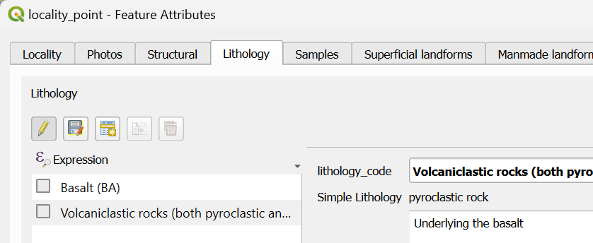{align=center}

*Editing Mode*
:::

 Finally, click on the name of the feature you wish to edit, it will be highlighted with a blue background.

:::{figure-md}
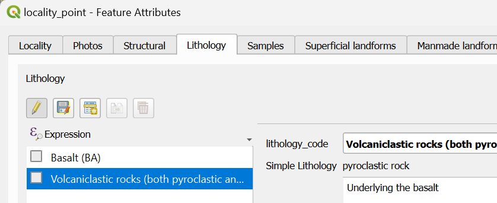{align=center}

*Feature Selected for Editing*
:::

Make any changes in the main panel and then click on the `Save Child Layer Edits` button to save the changes.

The move a locality point, select `Quick Edit Locality Point` to ensure the layer is selected and editable.
Then use the Move Feature tool from the Advanced Digitising toolbar.
To manually set the coordinates, select the Vertex Tool from the Digitising toolbar, then right click on the point.

### Deleting Child Features

To delete a child feature, select the checkbox next to the feature's name. This will be highlighted in yellow. It is possible to select multiple features by holding down the shift or control keys while clicking the checkbox.

:::{figure-md}
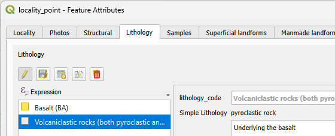{align=center}

*Feature Selected for Deletion*
:::

This will enable the `Delete` button on the right of the Child Feature Toolbar.

:::{figure-md}
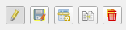{align=center}

*Child Feature Toolbar - deletion enabled*
:::

Click this button to delete the selected feature, save the changes and toggle editing mode.

:::{caution}
The feature selected for editing is highlighted in blue. The feature(s) selected for deletion are shown with a yellow checkbox.

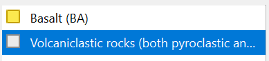{align=center}
:::

:::{note}
If there is just one feature selected and you wish to de-select it hold down control and click the checkbox. This will disable the `Delete` button.
:::

## Deleting Locality Points

To delete a locality point click the `Quick Delete Locality Point` button {class=icon} from the plugin toolbar or menu. The button should show as selected and the cursor will change to a cross when over the map. Click the cross on the  locality point. A warning dialog will appear, click Yes to delete the point or No to cancel.

:::{figure-md}
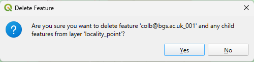{align=center width=400px}

*Delete a Locality Point*
:::
