# Plugin Tools

The CRAG plugin menu provides access to additional tools beyond those for creating points and lines: `Open Project Folder`, `Link Photos and Media`, `Create Field Report` and `Validate Current Project`.

:::{figure-md}
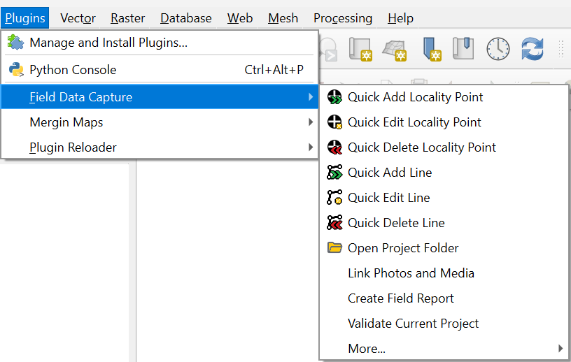{align=center}

*CRAG Tools*
:::

(open-project-folder)=
## Open Project Folder

This menu item also appears as a button, {class=icon}, on the plugin toolbar. Clicking on the button or menu item will open the current project's folder using the system browser.

:::{figure-md}
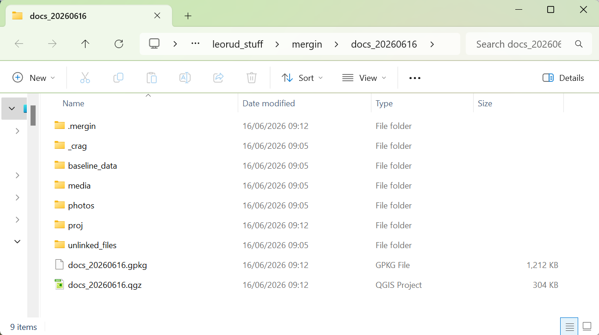{align=center}

*Project Folder*
:::

This folder contains a mixture of user data and files required for the plugin to work.
Plugin folders may include `proj` and `_crag`.
These should not be modified unless you know what you are doing.

The user data folders are:

`photos`
: This folder should be used to store any photos that will be linked to the locality points when creating points or by using the [Link Photos and Media](#link-photos-and-media) tool.

`media`
: This folder should be used to store any other media files that will be linked to the locality points when creating points or by using the [Link Photos and Media](#link-photos-and-media) tool.

`unlinked_files`
: This folder can be used to store photographs or files that are relevant to the project but not related to any individual points, any files in this folder will be uploaded to Mergin Maps when the project is synchronised.
  It is not recommended to store large files here, as they can slow synchronisation with Mergin Maps.

`baseline_data`
: This folder should be used to store files for other GIS data used within the project.
  These may include OS basemaps, background geology polygons, borehole data and data collected on previous field excursions.
  It is not recommended to store large files e.g. LiDAR terrain models here, as they can slow synchronisation with Mergin Maps.

You can create subfolders with the `photos`, `media` and `unlinked_files` folders to help organise your photos and media files.

:::{figure-md}
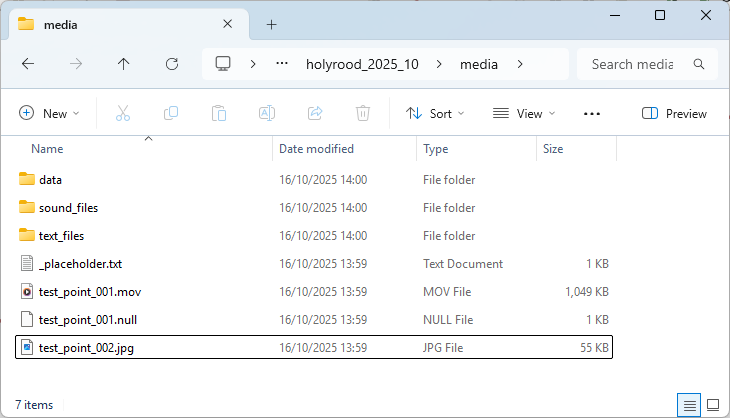{align=center}

*Media Folder*
:::

(link-photos-and-media)=
## Link Photos and Media

This tool links photos and media files to existing locality points.
While it is possible to [link files directly from a locality point](#add-photos-and-media-when-creating-a-point), it's often the case that a folder of photos will be copied into the project after the data points have been captured.

The `Link Photos and Media` tool scans for all unlinked files in the `photos` and `media` folders including any subfolders.
If all the files are already linked, the tool will confirm this with a dialog.

:::{figure-md}
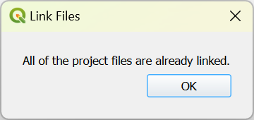{align=center width=400px}

*All Files Linked*
:::

If there are any photo or media records which are using the placeholder image, then a warning will be shown at the top of the dialog advising you to update placeholder records before using this tool.
This is not mandatory, but it may help you to organise your files.
If you click on the warning text, a list of locality point names which have placeholder photo or media records will be shown.

:::{figure-md}
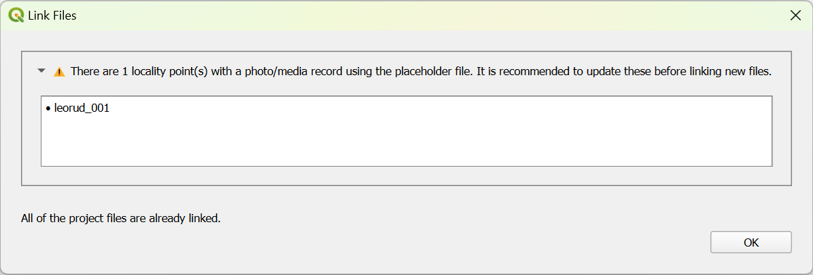{align=center}

*Placeholder Image Warning*
:::

If there are any unlinked files, then a list of all of the unlinked files, along with metadata and a thumbnail for a photo will be displayed.
The file name is a link that opens the file in the appropriate system application.

:::{note}
The locality_point dropdown shows the time that the point was created.
If a photo has a timestamp embedded in the metadata, this will be shown.
Make sure that the clocks on your camera and tablet have the correct setting so you can easily see which are related.
:::

:::{figure-md}
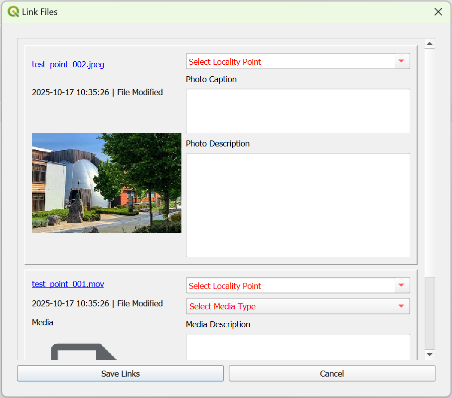{align=center}

*Link Photos and Media Tool*
:::

To link a photo, select a locality point from the drop-down menu and enter a caption and description in the boxes.
You can search for locality points by typing into the locality point box.

:::{figure-md}
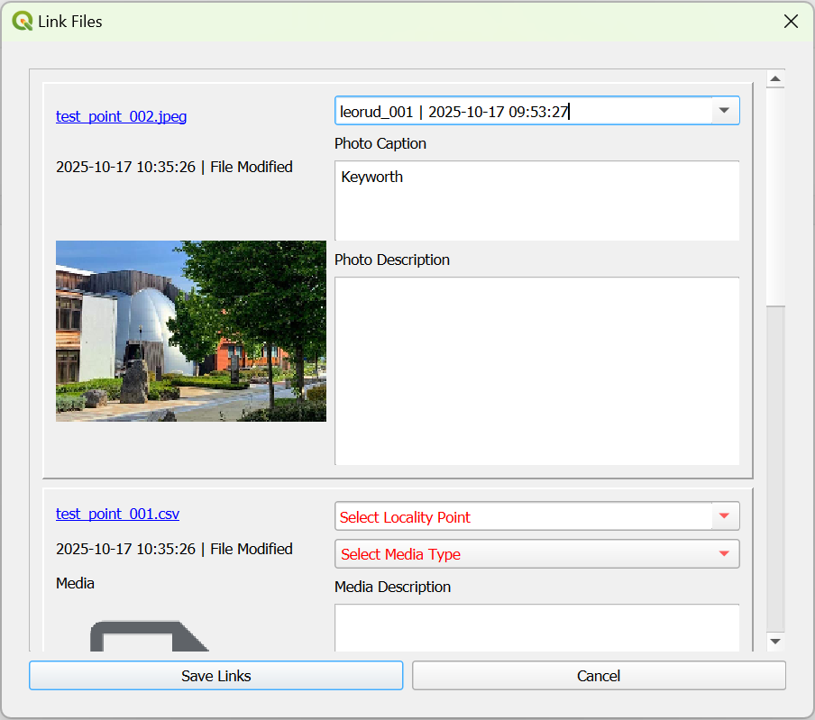{align=center}

*Link a Photo*
:::

To link a media file, select a locality point from the first drop-down menu and then select a media type from the second menu.

:::{figure-md}
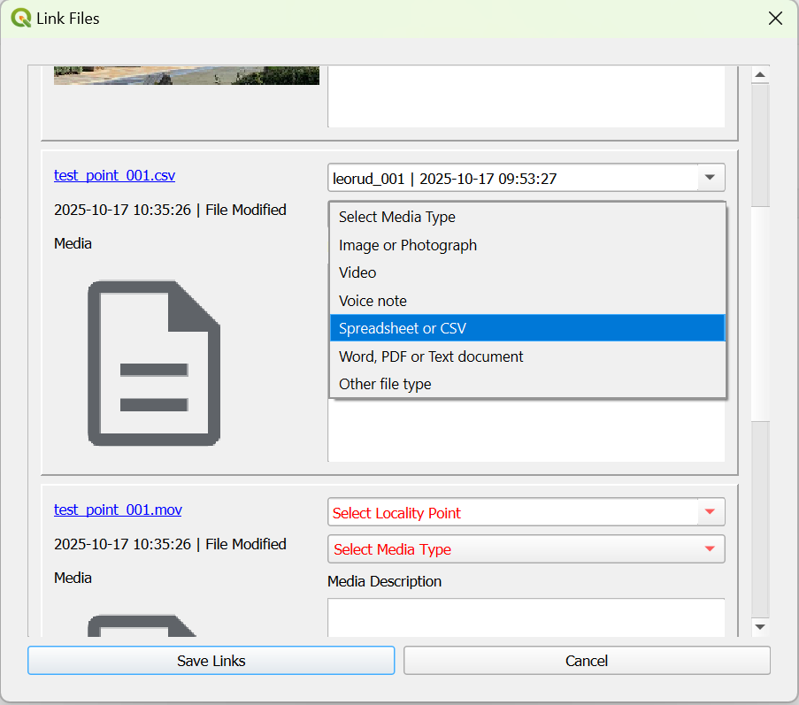{align=center}

*Select the Media Type*
:::

Enter a description for the media file.

:::{figure-md}
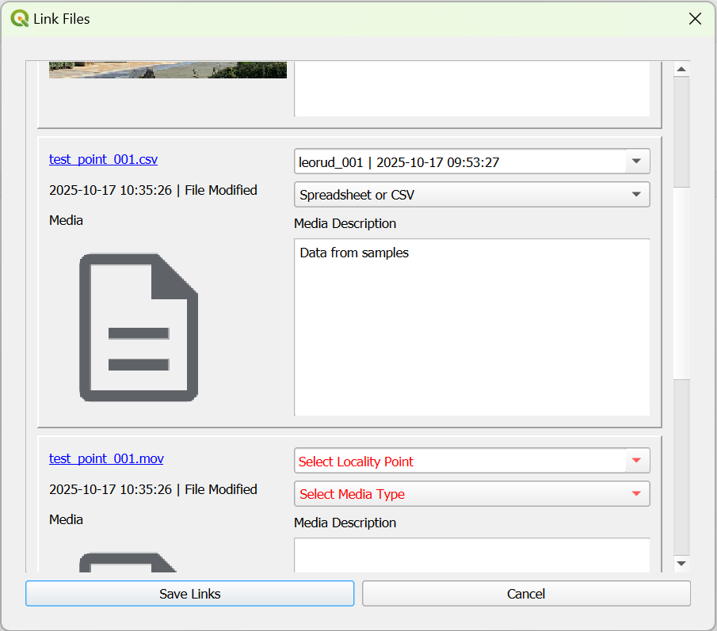{align=center}

*Link a Media File*
:::

Once you have linked all the files that a needed, click `Save Links`, this will confirm the number of files linked.

:::{figure-md}
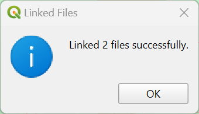{align=center width=400px}

*Confirm Successful Links*
:::

:::{note}
When copying in a folder of photographs, there may be photos in there that are unrelated to the locality points. These can be removed or deleted from the folder manually.
:::

## Validate Current Project

The `Validate Current Project` tool checks the integrity of the project data.
This is beyond the constraints on data provided by the GeoPackage database.
Among other things, the tool checks for unlinked photo and media files and invalid file paths.

If there are any unlinked files, the tool will show a dialog listing the unlinked files.
These files can then either be linked by using the [Link Photos and Media](#link-photos-and-media) tool or removed by [opening the project folder](#open-project-folder) to access the `photos` and `media` folders.

:::{figure-md}
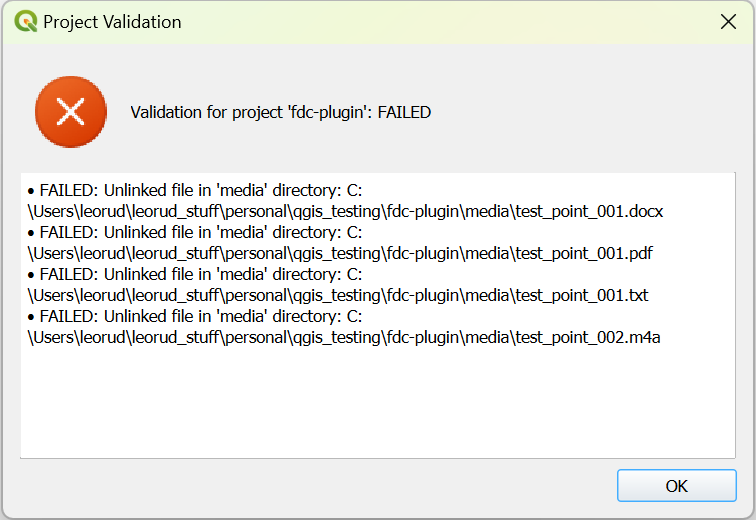{align=center width=400px}

*Project Validation - Failed*
:::

If there are no unlinked files, this will be confirmed.

:::{figure-md}
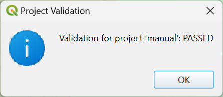{align=center width=400px}

*Project Validation - Passed*
:::

(create-field-report)=
## Create Field Report

This tool creates HTML and PDF reports based on the locality point data of the project. Click on `Create Field Report` from the menu to create the reports. If a you have previously created either report you will be asked if you wish to overwrite both of them.

:::{figure-md}
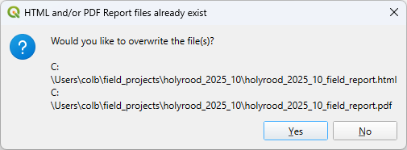{align=center width=400px}

*Field Report already exists*
:::

If the existing version of the PDF report is open by a PDF viewer it may not be possible for a new report to be created. If this happens you will see an error message asking you to close the PDF file and then create the reports again.

:::{figure-md}
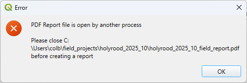{align=center width=400px}

*Existing PDF Field Report open*
:::

Once the reports have been created you will be asked if you wish to open them now.

:::{figure-md}
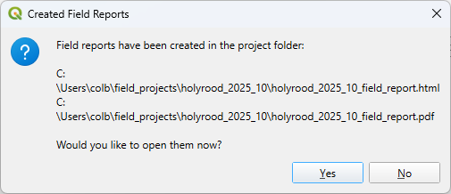{align=center width=400px}

*Field Reports have been created*
:::

:::{note}
The reports, once created, can be accessed at any time by [opening the project folder](#open-project-folder) and opening the file `field-report.html` in your browser or the file `project_name_field_report.pdf` in your PDF viewer.
:::

The HTML report comprises a table of contents, the project information and information for each locality point. The `Expand all` and `Collapse all` buttons will expand or collapse all of the locality point sections.

:::{figure-md}
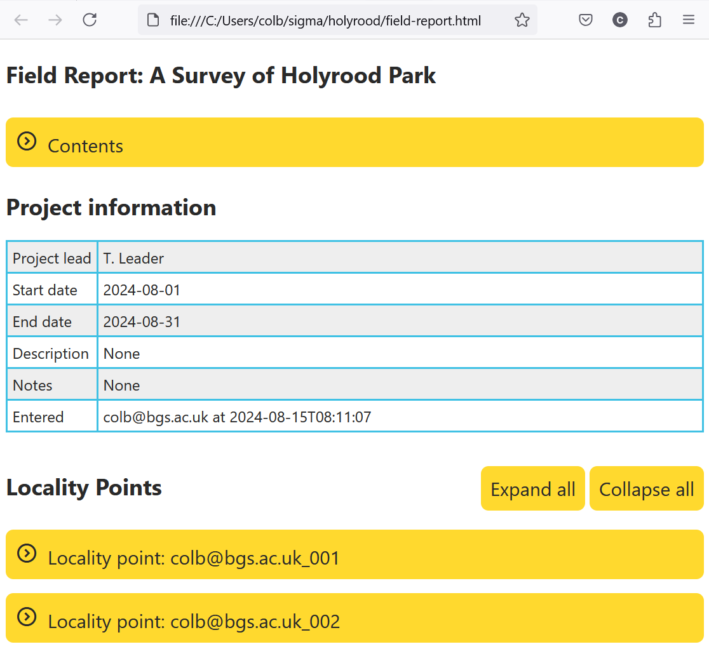{align=center}

*Field Report*
:::

Click the `Contents` bar to expand the table of contents. Each listed point is a link to that point's details in the report.

:::{figure-md}
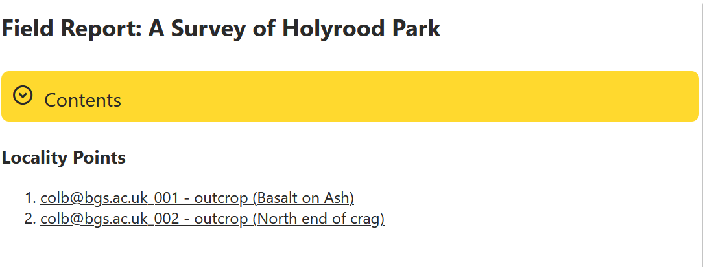{align=center}

*Field Report - contents*
:::

An individual point's information can be viewed by click on its title bar. The location can be opened in Google Maps by clicking on the link.

:::{figure-md}
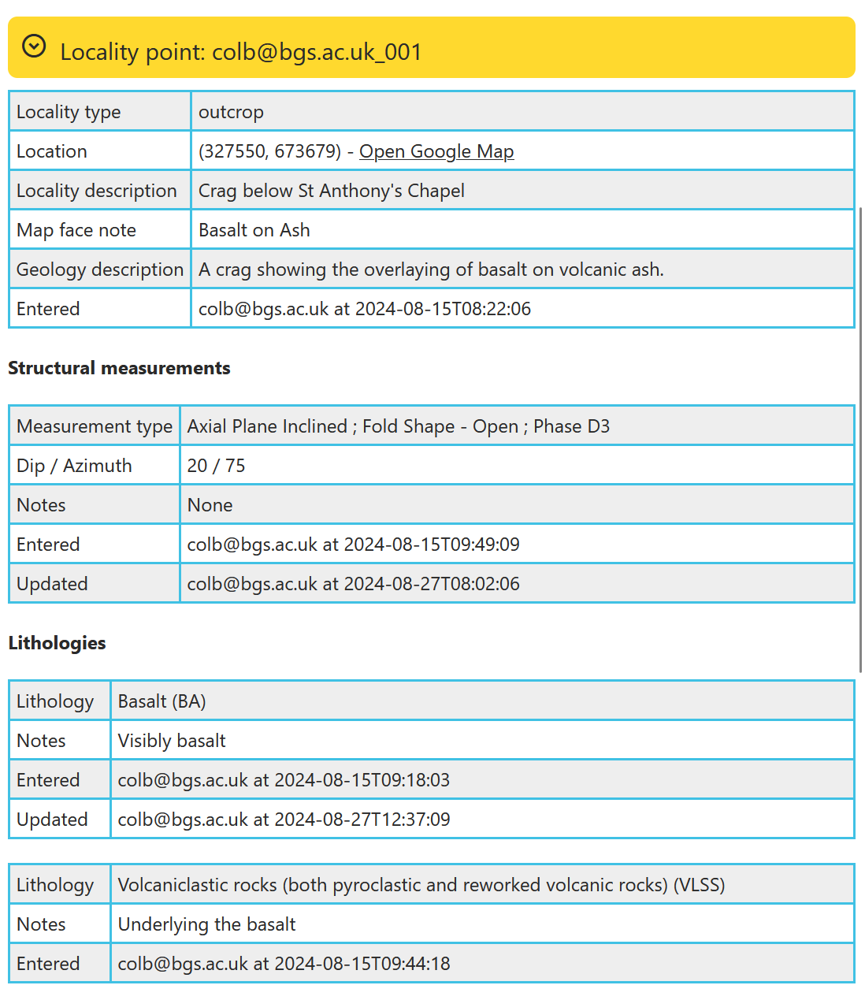{align=center}

*Field Report - locality information*
:::

Photos and media files show a thumbnail of the image or an icon representing the file type, clicking on any of these will open the photo or file in the appropriate system application. There is also a useful `Back to top` link to return to the top of the report.

:::{figure-md}
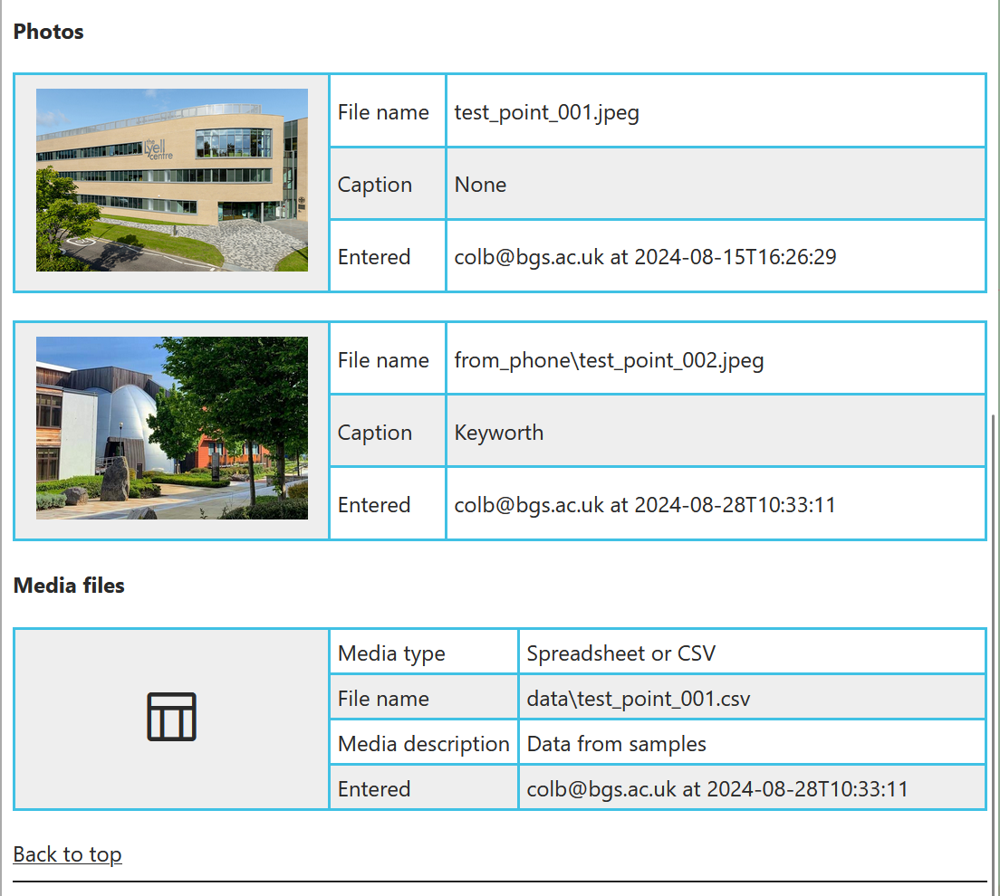{align=center}

*Field Report - photos and media*
:::

## More...

This submenu contains additional tools.

In addition to the `Plugin Settings` described below, there is `Setup Project`, the use of which is described in [Getting Started](#setup-project).

The remaining tools are primarily aimed at software developers and are not used in normal operation.

:::{figure-md}
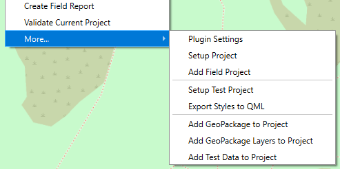{align=center}

*CRAG Advanced and Developer Tools*
:::

(plugin-settings)=
### Plugin Settings

The plugin has settings that affect the digitisation process and tools.
The settings dialog is at: `Plugins` > `CRAG` > `More...`, select `Plugin Settings`.

:::{figure-md}
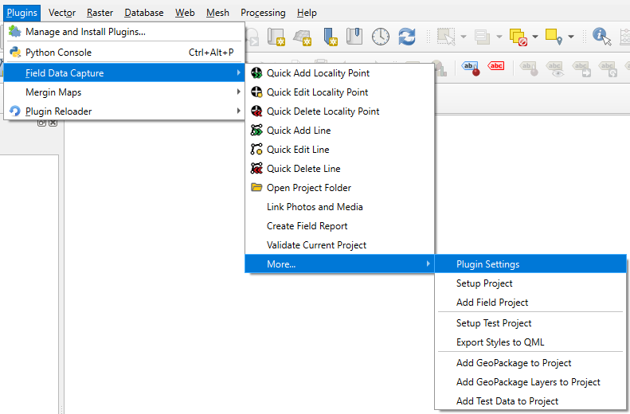{align=center}

*Plugin Settings Menu Item*
:::

If no project is currently open you will prompted to open one first.
If a project is open the Settings dialog will be displayed.

:::{figure-md}
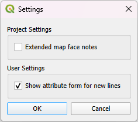{align=center}

*Plugin Settings Dialog*
:::

The settings are divided into two groups, Project Settings and User Settings.
Project settings relate to layers and styling and are stored in the QGIS project file.
New projects will have the default setting.
Changing a project setting and saving the project will apply that setting for everyone who uses it.
User settings relate to the how the tools work and are stored in the QGIS user profile settings.
The value applies to all projects on a given computer.

The settings attributes are:

`Extended map face notes`
: This option changes the annotation shown on the map for locality points.
  By default, map face note shows the contents of the `map_face_note` field.
  If this option is checked, the data from the `geological_description` is appended to the map face note.
  This is most useful for viewing multi-line notes (e.g. augur data) on the map.
  See the section on [adding locality points](#adding-points) for more details.

`Show attribute form for new lines`
: This setting determines the plugin's behaviour when creating new lines.
  By default, an attribute form is displayed when a new line is digitised.
  If you wish to create lines without attributes then uncheck this option.
  See the section on [adding lines](#adding-lines) for more details.

Once you have selected the settings, click OK to continue.

(help)=
### Help

When using the plugin, these HTML help pages can be accessed from both the plugin menu
and the QGIS Help menu.

:::{figure-md}
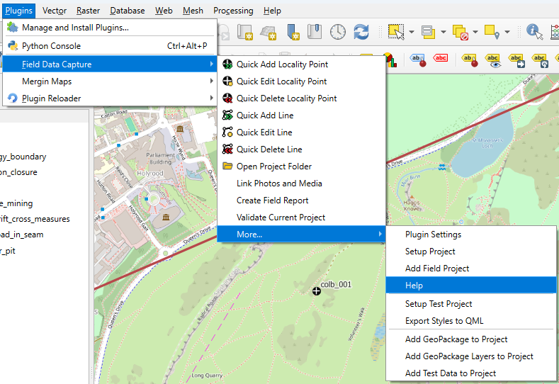{align=center}

*Accessing Help from the Plugin*
:::

:::{figure-md}
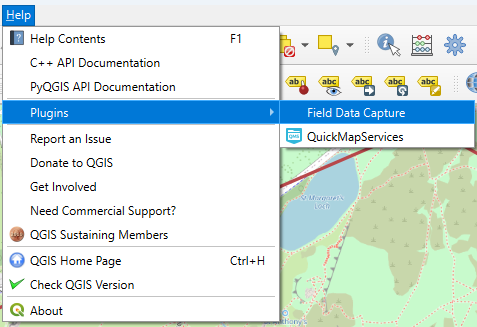{align=center}

*Accessing Help from QGIS*
:::

The HTML help pages will open in the default browser on the device you are using. The help pages are stored locally within the plugin and so no network connection is needed to access them.
