# Project setup

## Creating a folder for field data projects

The very first step before creating or downloading a project is to create a folder on your local drive (e.g. "C:") to hold all of your CRAG projects.
This *must* be on a local drive to avoid any issues with data access while in the field.

The recommended field data project folder location is:

`C:\Users\user_name\field_projects`

::::{important}
Storing projects on a cloud service, such as OneDrive, Dropbox or iCloud, breaks the synchronisation of projects with Mergin Maps.
Storing projects on cloud services or networked drives may also limit the availability of project data when working in the field.

:::{note}
On managed laptops, some standard local folders, for example **Documents**, may be mapped to cloud or network drives and so should be avoided.
:::
::::

(setup-project)=
## Creating a new project

### Project folder and file

The first step in creating a new project is to create a new QGIS project and save the project file to a new and empty folder inside your `field_projects` folder.
You can create the new folder in the file browser before saving the new project or create the new folder as you save the new project.
The folder and project names should be the same and should be kept short and descriptive.

The recommended format is _{location}\_{year}\_{month}_.

For example:

`C:\Users\user_name\field_projects\holyrood_2025_10`

To create a new project click on the `New Project` button.

:::{figure-md}
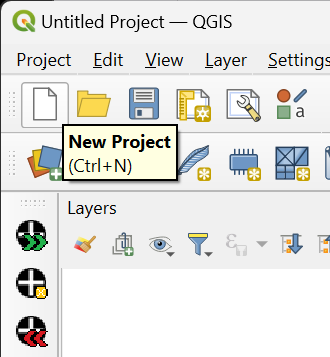{align=center}

*New Project*
:::

Then save the project, clicking on the `Save Project` button.

:::{figure-md}
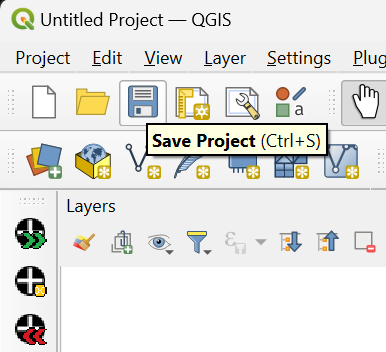{align=center}

*Save Project*
:::

Navigate to the new project folder (or create one after navigating to the `field_projects` folder), select that folder, enter the project name and click `Save`.

:::{figure-md}
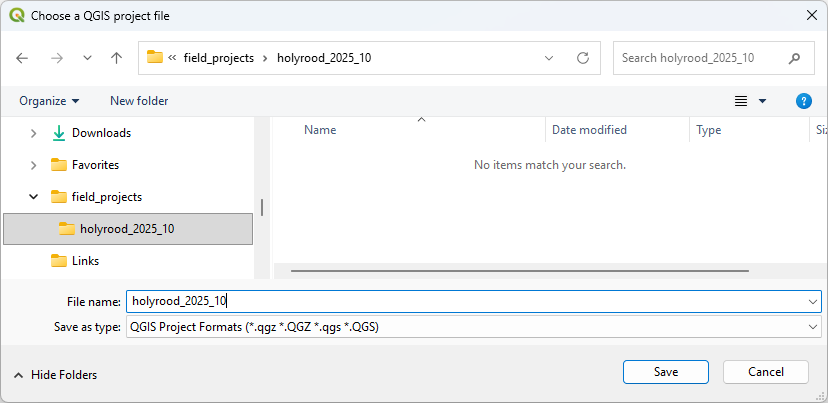{align=center}

*Saving Project*
:::

At this stage, it is recommended to add a basemap to your project that will allow you to locate the field project area.
For a guide on how to add baseline data to a project see [baseline data section](#adding-baseline-data).

### Adding CRAG layers

Using the CRAG plugin, `Plugins` > `CRAG` > `More...`, select `Setup Project`, clicking `OK` on the confirmation dialog messages.
This adds the project layers (including forms and styling) to the current open project.
A geopackage file to store field data is added to the project folder.

:::{figure-md}
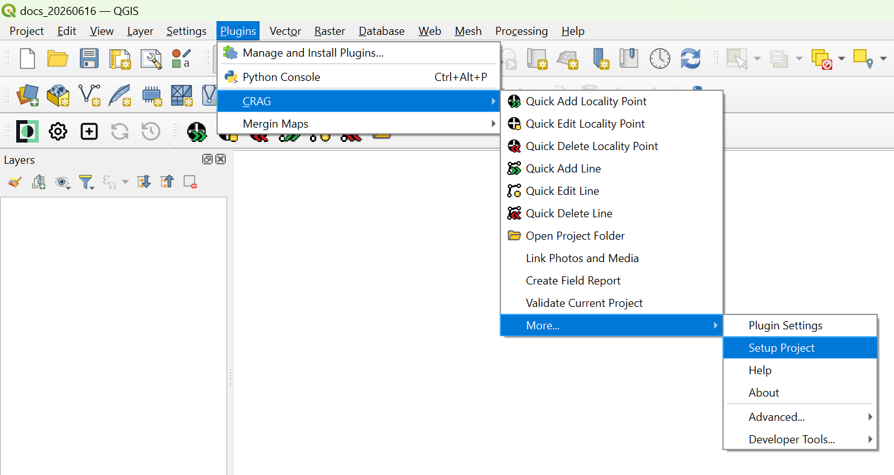{align=center}

*Setup Project*
:::

:::{figure-md}
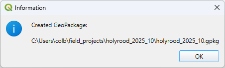{align=center width=400px}

*Confirmation that the GeoPackage has been created*
:::

Click OK to continue.

:::{figure-md}
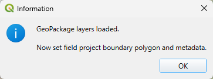{align=center width=400px}

*Confirmation that the GeoPackage layers are loaded*
:::

Click OK to continue.

A drawing tool will be automatically toggled for you to draw a polygon boundary for your field project area. Draw the polygon, using a standard mouse left-click for each point and right-click to finish the polygon.

If necessary the polygon can be edited later using the *QGIS Vertex Tool*, see {doc}`../qgis_basics`.

:::{figure-md}
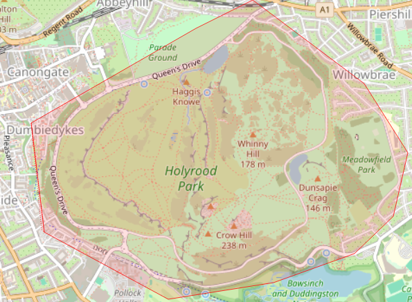{align=center}

*Drawing a polygon boundary*
:::

::::{note}
If you do anything else before creating the boundary, adding a layer for instance, then you can return to drawing the boundary easily,
using the CRAG plugin: `Plugins` > `CRAG` > `More...` > `Advanced...`, select `Add Field Project Polygon`.

:::{figure-md}
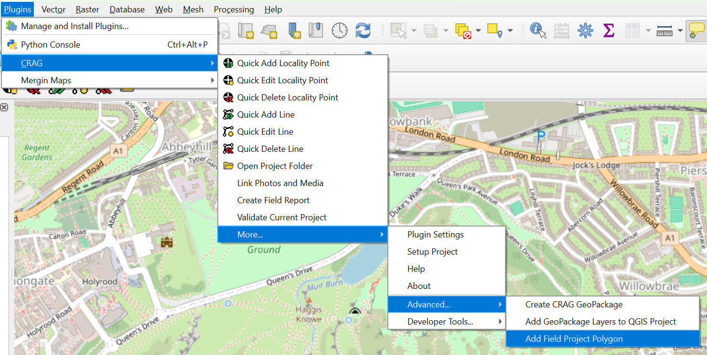{align=center}

*Add Field Project*
:::

Now draw your boundary as described above.
::::

Once the polygon is completed, the `field_project` form will appear. 

:::{figure-md}
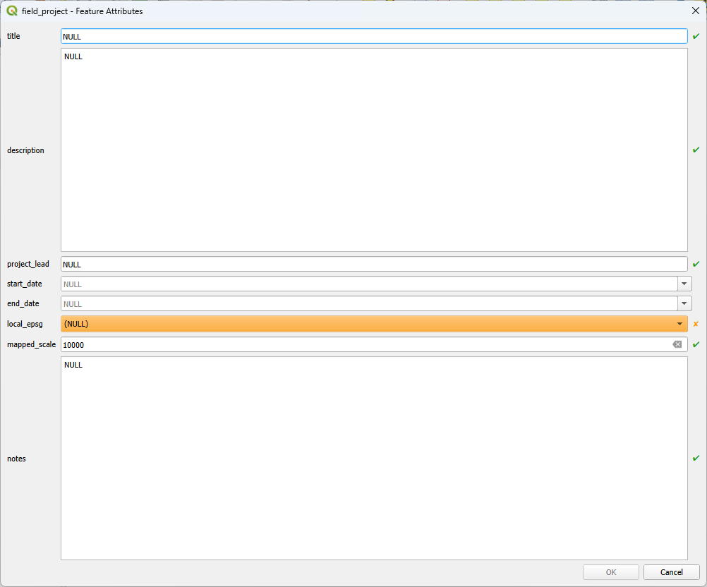{align=center}

*Field Project form*
:::

Required fields are shown with a small orange 'x' at the right and sometimes highlighted in orange.
Some required fields have a default value.
Once completed the 'x' turns to a green tick and the highlighting is removed.
All other fields are optional and set to NULL by default.

In general, single line fields are limited to 255 characters, while multi-line fields are limited to 4000 characters.
If the character limit for any field is exceeded the text will turn orange and a small orange 'x' will appear on
the right. The text in such a field will need to be edited to bring it within the character limit before
the form can be saved.

:::{note}
The restrictions on required fields and character limits applies to all forms used by the plugin.

:::

Many of the fields are self-explanatory, some are explained below.

`title`
: The formal title for the project which must be agreed with the project lead

`local_epsg` _required_
: This is determines coordinate reference system (EPSG code) use to display coordinates in metadata and views.
  Internally, the data are stored in WSG 84.

`mapped_scale` _required_
: Enter the mapped scale, the default value is 10000 (1:10000)

The date fields can either be entered as text in standard YYYY-MM-DD format or using the
calendar available by clicking the dropdown arrow.

:::{figure-md}
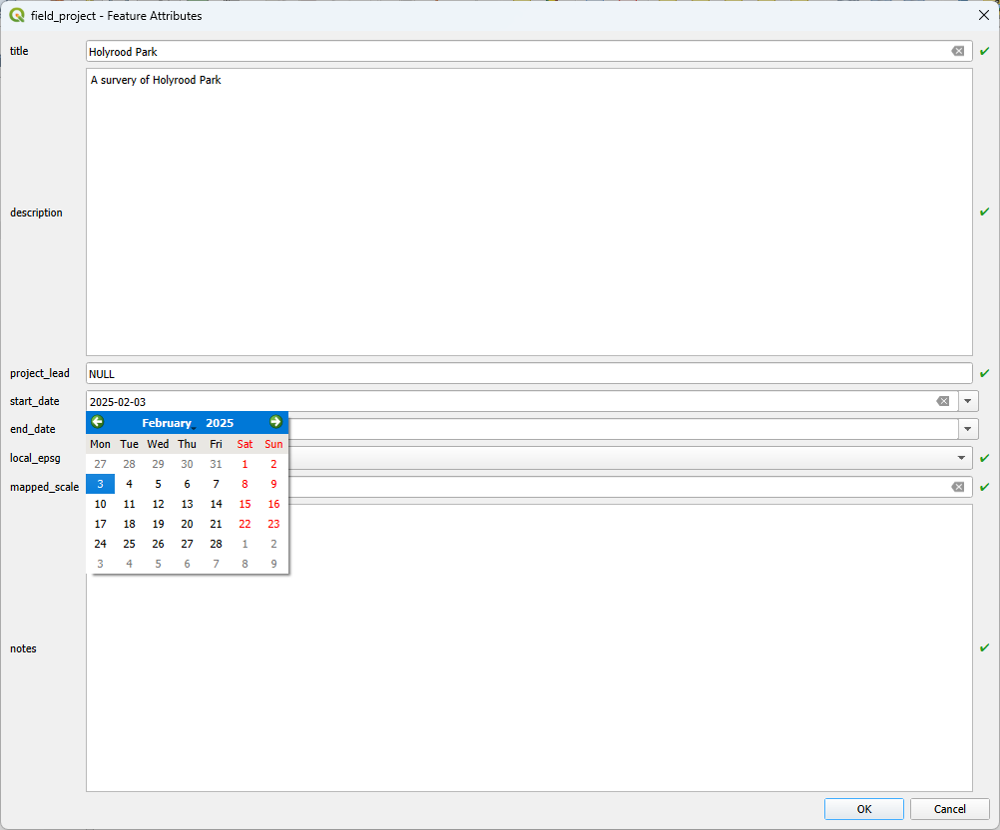{align=center}

*Field Project form - date entry*
:::

Complete the form with details of your field project, click `OK`.
The polygon boundary should now be displayed on the base map and the project layers shown in the `Layers` pane.

:::{figure-md}
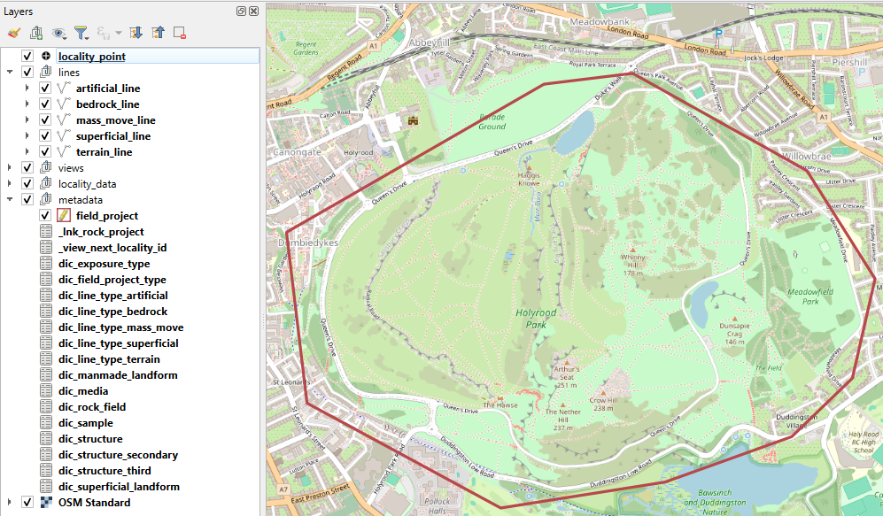{align=center}

*GeoPackage layers and Project boundary*
:::

Save the project again.

### Project default extent

You can set the default extent for the project in "Project > Properties > View Settings > Set Full Project Extent".
The Mergin Mobile app will zoom to this when the project is opened.

### Project Files and Folders

When a new project is first created a number of files and folders are created in the project folder:

`project_name.qgz`
: This is the QGIS project file saved above.

`project_name.gpkg`
: This is the geopackage file containing the data for the project. When new points and lines are created their data will be stored in this file.

`baseline_data`
: This folder is used to store any baseline data files required by the project. See below.

`photos`
: This folder is used to store photos related to individual data points.

`media`
: This folder is used to store media files related to individual data points.

`unlinked_files`
: This folder is used to other files associated with the project generally.

`_crag`
: This folder stores system files and folders. _It should not be modified!_

(adding-baseline-data)=
## Adding baseline data

### Baseline data folder

Baseline data, such as regional topographical or geological maps, should be stored within the `baseline_data`
folder within a project folder.
This ensures that the data are synchronised with the project via the Mergin Maps server.

:::{note}
Do not put large files in this folder, e.g. LiDAR DTMs, as they cause problems with project syncing.
If you need large baseline data files, please see [Mergin Maps: How to work with very large files](https://merginmaps.com/docs/gis/settingup_background_map/#how-to-work-with-very-large-files)
to learn about storing baseline data outside the main project.
:::

### OpenStreetMap web map

The simplest way to get a basemap in QGIS is to add the OpenStreetMap web map to your open project via the QuickMapTools plugin.

+ Install the QuickMapTools plugin to QGIS (the same way that the Mergin Maps plugin is installed)
+ Go to  `Web` > `QuickMapServices` to see the available base maps
+ Select `OSM` > `OSM Standard`

Note that this web map is only available when the system is online.
Disable or remove this layer when working in the field.

## Mergin Maps

### Uploading a Project to Mergin Maps

Once a project has been created it can be uploaded to a Mergin Maps server. Click on the `Create Mergin Maps project` button on the `Mergin Maps Toolbar`.

:::{note}
This step is best undertaken with a fast, reliable network connection.
:::

:::{figure-md}
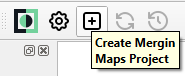{align=center}

*Create Mergin Maps Project*
:::

Click on the bottom button, `Use current QGIS project as is`.

:::{figure-md}
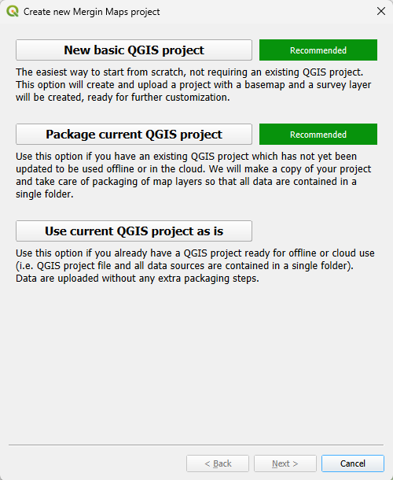{align=center}

*Mergin Maps Upload Project*
:::

Ensure the Workspace set to the correct name and fill in the Project Name, this should match the .qgz project file name.
The project folder should already be set to the current project's directory.
Click Finish.

:::{figure-md}
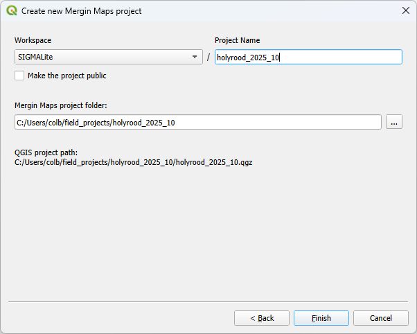{align=center}

*Mergin Maps Project Details*
:::

Mergin will scan the project and determine the files to upload.
If it reports an issue with the projection system and offers to fix it, select that option.
This will add a `.mergin` folder which stores system information used by Mergin Maps
and a `proj` folder that contains geoid corrections for converting between OSGB and WGS84 data.

Depending on the size of the project, which will be related to the base map and other baseline data,
this step could take some time as data is uploaded. A progress dialog should appear.

:::{figure-md}
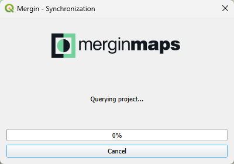{align=center}

*Mergin Maps Upload Progress*
:::

Once the project is uploaded you will see a confirmation dialog.

:::{figure-md}
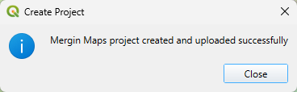{align=center width=400px}

*Mergin Maps Upload Complete*
:::

You are now ready to start collecting field data with the project and any future changes can be uploaded by synchronising the project.

:::{note}
The entire contents of the project folder are synced by Mergin and to anyone who downloads it.
Consider the data protection (GDPR) implications of storing personal information, e.g. landowner contact details, in the project folder.
:::

### Downloading an Existing Project

If you would like to work on an existing project which has already been uploaded to the Mergin Maps server, this can be downloaded from the Mergin Maps item in the QGIS Browser pane.
Before downloading a project you should refresh the view.
Right click on Mergin Maps and select `Refresh` from the menu.

:::{note}
This step is best undertaken with a fast, reliable network connection.
:::

:::{figure-md}
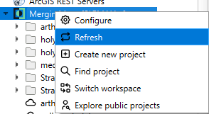{align=center}

*Mergin Maps Refresh*
:::

Already downloaded projects are shown with the folder icon, with the cloud icon indicating a project that has not yet been downloaded. To download a specific project, right click on the cloud for that project and select `Download` from the menu.

:::{figure-md}
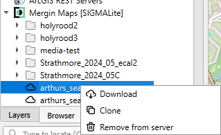{align=center}

*Mergin Maps Download*
:::

QGIS will prompt you to select a folder for the project using the system file browser. The project should be stored in your `field_projects` folder, select that and click OK.

:::{figure-md}
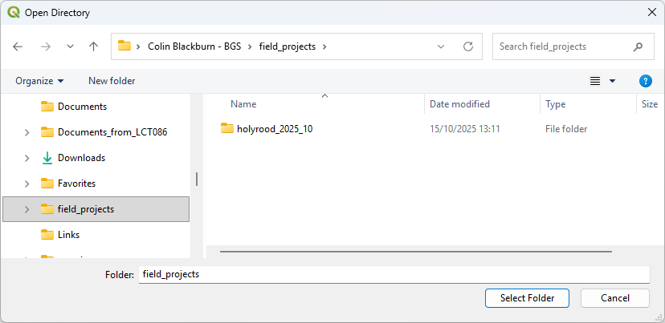{align=center}

*Select Folder*
:::

Depending on the size of the project, which will be related to the base map and other baseline data, this step could take some time as data is downloaded. A progress dialog should appear.

:::{figure-md}
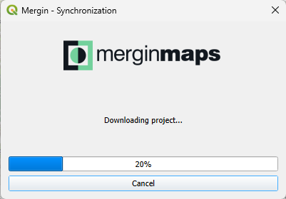{align=center}

*Mergin Maps Download Progress*
:::

Once the project is downloaded you will be asked whether you want to open the project now, click Yes if you do. If you want to open the project later that can be done using the QGIS `Open Project` button or `Project` menu item

:::{figure-md}
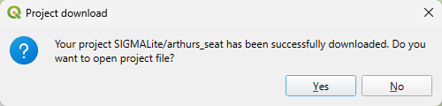{align=center width=400px}

*Mergin Maps Download Complete*
:::
