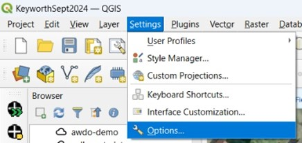
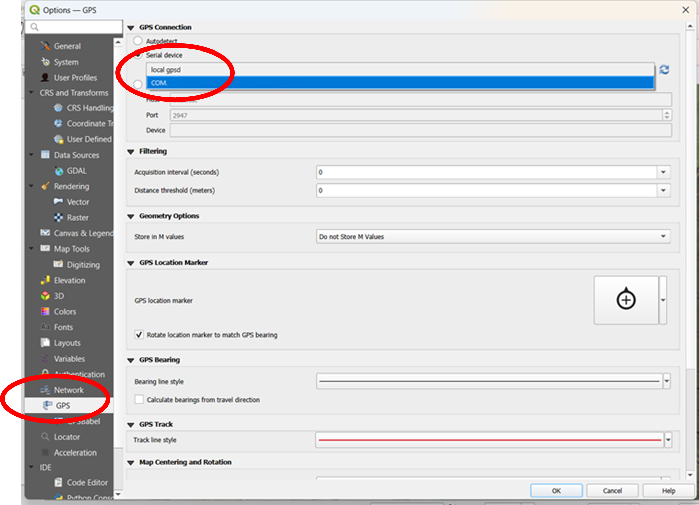
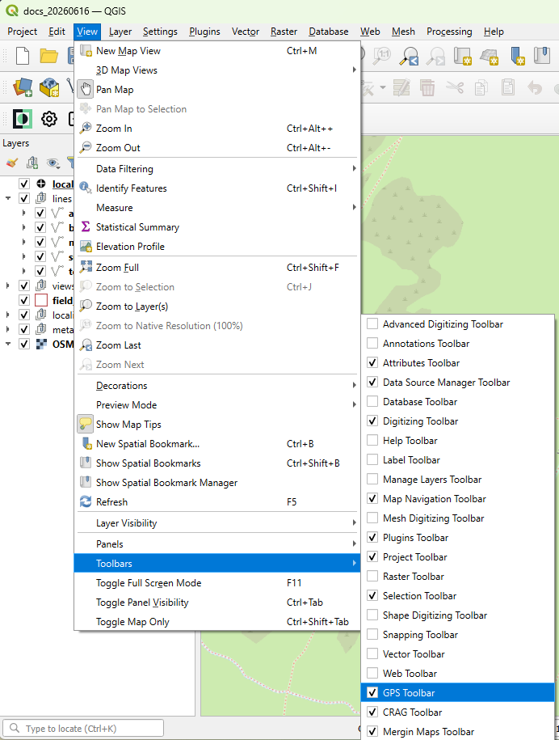
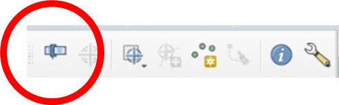
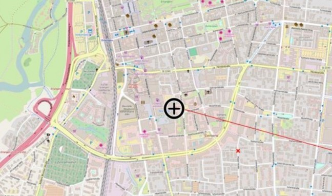

# Field tablet setup

Toughbook or Toughpad tablets, which use the Windows operating system, can be used with the CRAG system.
Field data capture is done using QGIS.
This section describes how to configure these Windows-based tablets.

## GPS systems

### Connecting to GPS

The GPS is configured directly through QGIS.

Select `Options` from the `Settings` menu.

:::{figure-md}
{align=center}

*GPS Setup - select Options*
:::

Click on `GPS` in the left hand pane, then select `Serial Device` in the `GPS Connection` section.
Set the COM port for the GPS from the drop-down menu.
The GPS port is the one with NMEA in the description.
(NMEA is the name of the protocol used to transmit GPS data.)

:::{figure-md}
{align=center}

*GPS Setup - set Serial Device*
:::

Select `Toolbars` from the `View` menu and then check `GPS Toolbar` from the sub-menu.

:::{figure-md}
{align=center}

*GPS Setup - enable GPS Toolbar*
:::

The GPS toolbar should now be available with the other QGIS toolbars.
Turn on GPS using the first button, this is best done outdoors with a clear view of the sky.
If the tablet has moved far from where it was last used, it can take a long time (over 5 minutes) to get an initial fix.

:::{figure-md}
{align=center}

*GPS Setup - turn on GPS*
:::

Once the position is locked, a crosshair will appear on the map canvas at the current position.

:::{figure-md}
{align=center}

*GPS Setup - GPS on*
:::

### Troubleshooting GPS issues

Sometimes the GPS disconnects when the tablet sleeps.
You can tell this because the Time of Fix in the GPS Information tab stops updating.
It is important to check this before making a point where you are.
Normally it can be fixed by disconnecting and reconnecting, but sometimes you have to go in and change the port to the wrong one and then back to the correct one again.

## Software keyboard tips

The following tips are useful when using the software-based keyboard on the Windows tablets.

+ Sometimes the touch keyboard covers the form on QGIS so that you can't see to enter data.
  You can change the settings to turn it into a floating keyboard that can be moved.

+ It's a pain to have to delete NULL from text boxes when you open them.
  It's slightly easier if you double-click the word to highlight it and then start typing.
